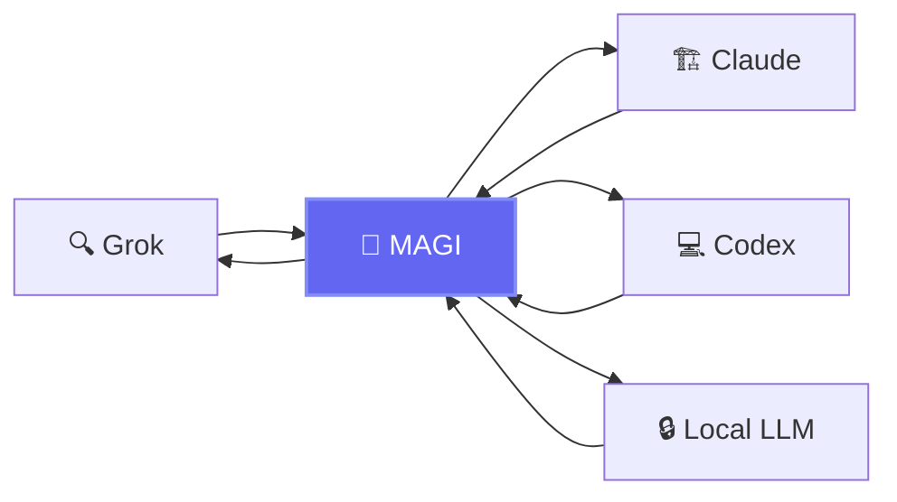
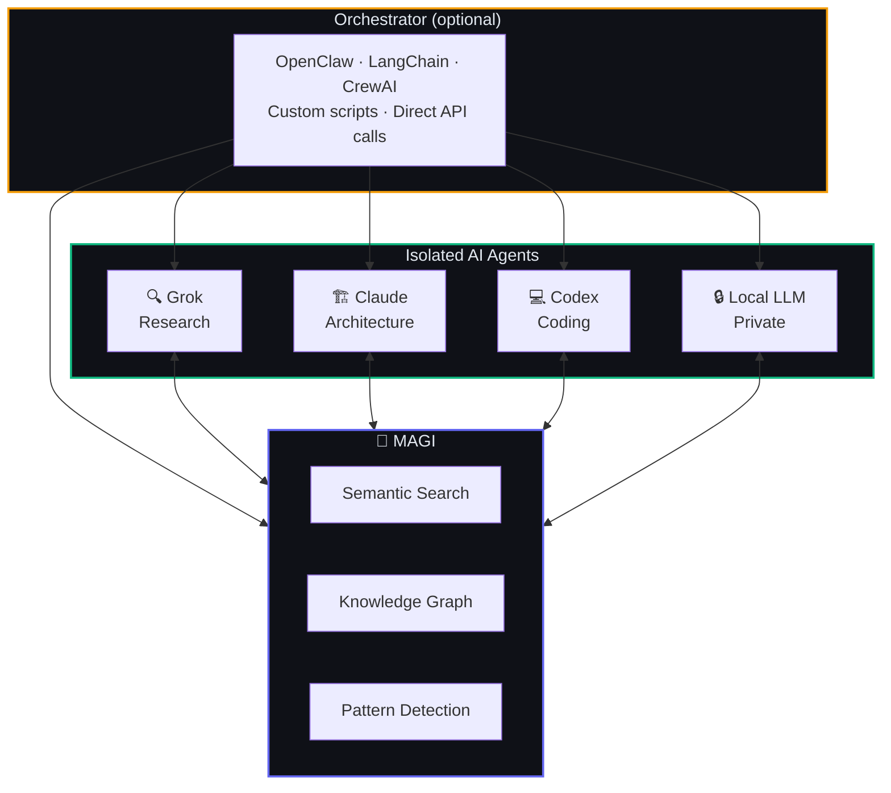
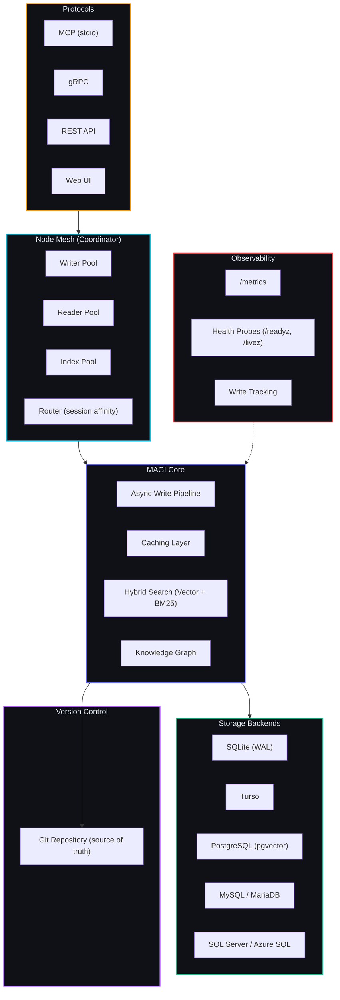

<p align="center">
  
</p>
<h1 align="center">MAGI</h1>
<p align="center"><strong>Multi-Agent Graph Intelligence</strong></p>
<p align="center">Universal memory for AI agents. Self-hosted. Multi-protocol. Agent-agnostic.</p>

<p align="center">
  <a href="https://github.com/j33pguy/magi/wiki">Wiki</a> ·
  <a href="https://github.com/j33pguy/magi/wiki/Getting-Started">Quick Start</a> ·
  <a href="https://github.com/j33pguy/magi/wiki/REST-API-Reference">API Docs</a> ·
  <a href="https://github.com/j33pguy/magi/wiki/Architecture">Architecture</a>
</p>

---

## What's New in v0.2.0

- **Distributed Node Mesh** — Writer, Reader, Index, and Coordinator node types with goroutine pool routing, session affinity for read-your-writes consistency, zero overhead in embedded mode (PR #74)
- **Metrics Endpoint** — 9 metrics: write/search latency, embedding duration, queue depth, memory count, session count, cache hit/miss, git commits. Scrape `/metrics` (PR #73)
- **Health Probes** — `/readyz` and `/livez` for Kubernetes, expanded `/health` with DB status, uptime, memory count, git status (PR #73)
- **Write Tracking Helpers** — `TrackTask`, `TrackDecision`, `TrackConversation` for production dogfooding (PR #73)
- **MCP Config Generator** — `magi mcp-config` outputs ready-to-paste JSON for Claude/Codex (PR #73)
- **Chaos Testing** — Concurrent writes, search-during-ingestion, kill recovery, cache overflow (PR #73)
- **SQL Server Backend** — Full support for SQL Server / Azure SQL (PR #71)

---

## What's New in v0.3.0

- **Web UI Auth** — Web UI now enforces Bearer auth via `MAGI_API_TOKEN` and respects memory visibility
- **UI Toggle** — `MAGI_UI_ENABLED` enables or disables the web UI server
- **Async Writes Now Live** — The async write pipeline is fully functional with `MAGI_ASYNC_WRITES=true`
- **gRPC Graph Parity** — `LinkMemories` and `GetRelated` RPCs are now implemented
- **PostgreSQL + MySQL Factory Wiring** — Backend factory now includes PostgreSQL and MySQL
- **Unified Remember Enrichment** — classify, secret detection, dedup, and contradiction checks now run consistently across MCP, gRPC, and REST
- **New remember Service Layer** — `internal/remember` centralizes write enrichment logic
- **stdio-Only MCP Mode** — `--mcp-only` runs MCP stdio without HTTP/gRPC servers for agent subprocess integrations

---

Your AI agents are brilliant — and completely amnesiac. Grok discovers a breaking API change. Claude doesn't know about it when reviewing your code. Codex builds a module. Your local LLM has no idea it exists.

**MAGI gives all your agents a shared brain.**



## The Bigger Picture

MAGI is the memory layer. Plug it into any orchestration setup — or use it standalone.



Route work however you want — [OpenClaw](https://github.com/openclaw/openclaw), LangChain, CrewAI, a bash script, or direct API calls. MAGI doesn't care how agents get their tasks. It just makes sure every agent has access to what every other agent has done.

## Why MAGI?

- **Git-Versioned Memory** — Every mutation is a git commit. Full history, diffs, and rollback for every memory. The database is a derived index; the git repo is the source of truth. No other AI memory system has this.
- **Distributed Node Mesh** — Writer/Reader/Index/Coordinator pools with session affinity. Zero-overhead embedded mode, ready for multi-node in Phase 2.
- **Semantic Search** — Hybrid vector + BM25 with local ONNX embeddings
- **Knowledge Graph** — Auto-linked memories with D3.js visualization
- **Pattern Detection** — Surfaces behavioral insights across all agents
- **Async Write Pipeline** — Returns 202 Accepted in <10ms. Worker pool with batch INSERT for throughput.
- **Metrics Endpoint** — Write/search latency, queue depth, cache stats, embedding duration. Scrape `/metrics`.
- **Health Probes** — `/readyz`, `/livez`, expanded `/health`. Kubernetes-ready.
- **Multi-Protocol** — MCP · gRPC · REST · Web UI
- **Multi-Backend** — SQLite · Turso · PostgreSQL (pgvector) · MySQL/MariaDB · SQL Server/Azure SQL
- **Self-Hosted** — Your data, your hardware. Zero cloud dependencies.
- **Agent-Agnostic** — Works with any agent that speaks HTTP, gRPC, or MCP

## Quick Start

```bash
<<<<<<< release/v0.3.0
# Docker (MEMORY_BACKEND: sqlite | turso | postgres | mysql | sqlserver)
docker run -d -p 8302:8302 -p 8080:8080 -e MEMORY_BACKEND=sqlite ghcr.io/example-org/magi:latest
=======
# Docker (MEMORY_BACKEND: sqlite (default) | turso | postgres | mysql | sqlserver)
docker run -d -p 8302:8302 -p 8080:8080 -e MEMORY_BACKEND=sqlite ghcr.io/j33pguy/magi:latest
>>>>>>> main

# Binary
MEMORY_BACKEND=postgres ./magi --http-only

# From source
git clone https://github.com/j33pguy/magi.git && cd magi && make build

# Generate MCP config for Claude/Codex
magi mcp-config
```

### Verify It's Running

```bash
# Liveness
curl http://localhost:8302/livez

# Readiness (checks DB)
curl http://localhost:8302/readyz

# Full health (DB status, uptime, memory count, git status)
curl http://localhost:8302/health

# Metrics endpoint
curl http://localhost:8302/metrics
```

## Use It

```bash
# Grok stores a finding
curl -X POST http://localhost:8302/remember \
  -H "Authorization: Bearer $TOKEN" \
  -d '{"content": "v3 API deprecates /users", "project": "myapp", "type": "decision", "speaker": "grok"}'

# Claude recalls it during code review
curl -X POST http://localhost:8302/recall \
  -d '{"query": "API changes", "limit": 5}'
```

## What's Inside

| Feature | Description |
|---------|-------------|
| Distributed Node Mesh | Writer/Reader/Index/Coordinator pools, session affinity, zero-overhead embedded mode. |
| Git-Backed Memory Versioning | Every mutation = git commit. Full history, diffs, rollback. DB is a derived index. |
| Async Write Pipeline | 202 Accepted in <10ms. Worker pool with batch INSERT for high throughput. |
| Caching Layer | Query cache (SHA256 key, 60s TTL), LRU memory cache (1000 items), embedding cache. |
| Metrics Endpoint | 9 metrics: write/search latency, queue depth, cache stats, embedding duration, git commits. |
| Health Probes | `/readyz`, `/livez`, expanded `/health` with DB status, uptime, memory count, git status. |
| Write Tracking | TrackTask, TrackDecision, TrackConversation helpers for production dogfooding. |
| 20 MCP tools | Full agent integration via stdio |
| REST + gRPC APIs | Any language, any platform |
| Web Dashboard | Browse, search, graph, analyze |
| Knowledge Graph | Auto-linked with typed relationships |
| Pattern Analyzer | Detects preferences, habits, decision styles |
| 10 Memory Types | Decisions, lessons, incidents, preferences, and more |
| Pluggable Storage | SQLite · Turso · PostgreSQL (pgvector) · MySQL/MariaDB · SQL Server/Azure SQL |
| Chaos Testing | Concurrent writes, search-during-ingestion, kill recovery, cache overflow. |

## vs. Alternatives

| | MAGI | mem0 | Zep | ChromaDB |
|-|------|------|-----|----------|
| Git versioning | ✅ | ❌ | ❌ | ❌ |
| Distributed node mesh | ✅ | ❌ | ❌ | ❌ |
| Knowledge graph | ✅ | ❌ | ❌ | ❌ |
| Pattern detection | ✅ | ❌ | ❌ | ❌ |
| Async pipeline | ✅ | ❌ | ❌ | ❌ |
| Metrics endpoint | ✅ | ❌ | ❌ | ❌ |
| Health probes (k8s) | ✅ | ❌ | ❌ | ❌ |
| Typed memories | ✅ | ❌ | Partial | ❌ |
| Orchestrator-agnostic | ✅ | ❌ | ❌ | ❌ |
| Self-hosted | ✅ | Cloud-first | ✅ | ✅ |
| Multi-protocol | MCP+gRPC+REST | REST | REST | REST |
| Storage backends | SQLite, Turso, PostgreSQL, MySQL, SQL Server | Qdrant/Pinecone | Postgres | Chroma |
| Web UI | ✅ | ❌ | ❌ | ❌ |

## Performance

| Metric | Before | After |
|--------|--------|-------|
| Write latency | ~3,000ms (sync) | <10ms (async pipeline, 202 Accepted) |
| Search | Sequential vector + FTS | Parallel vector + FTS via errgroup |
| Query cache | None | SHA256-keyed, 60s TTL |
| Hot memory cache | None | LRU, 1000 items |
| Embedding cache | Recompute every time | Skip ONNX on identical content |
| SQLite mode | Default | WAL mode + connection pooling |

## Architecture



## Docs

**[Full documentation in the Wiki →](https://github.com/j33pguy/magi/wiki)**

[Getting Started](https://github.com/j33pguy/magi/wiki/Getting-Started) · [Architecture](https://github.com/j33pguy/magi/wiki/Architecture) · [MCP Tools](https://github.com/j33pguy/magi/wiki/MCP-Tools-Reference) · [REST API](https://github.com/j33pguy/magi/wiki/REST-API-Reference) · [Multi-Agent Setup](https://github.com/j33pguy/magi/wiki/Multi-Agent-Setup) · [Knowledge Graph](https://github.com/j33pguy/magi/wiki/Knowledge-Graph) · [Deployment](https://github.com/j33pguy/magi/wiki/Deployment-Guide) · [Config](https://github.com/j33pguy/magi/wiki/Configuration) · [FAQ](https://github.com/j33pguy/magi/wiki/FAQ)

## In Memory Of

This project is dedicated to **Mary Margaret** — a dear friend who believed that the things worth remembering are the things that connect us. MAGI carries her spirit: nothing important should ever be forgotten.

<<<<<<< release/v0.3.0
## License

[Elastic License 2.0 (ELv2)](LICENSE) — free to use, modify, and self-host. Cannot be offered as a managed/hosted service without a commercial license from the author.

=======
>>>>>>> main
## Docker Compose

```bash
# Build the binary into the repo root for the Dockerfile build context
CGO_ENABLED=1 go build -o magi .

# Build and start
docker compose up --build -d
```

The compose file runs the SQLite backend by default and exposes:
- `8080` Web UI
- `8300` gRPC
- `8301` gateway
- `8302` REST API

Persistent data (SQLite DB and ONNX models) is stored in the named volume `magi-data` mounted at `/data`.

## License

[Elastic License 2.0 (ELv2)](LICENSE) — free to use, modify, and self-host. Cannot be offered as a managed/hosted service without a commercial license from the author.
