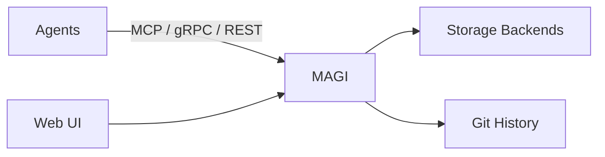

<p align="center">
  
</p>
<h1 align="center">MAGI</h1>
<p align="center"><strong>Multi-Agent Graph Intelligence</strong></p>
<p align="center">AI agents shouldn't work in isolation. With MAGI, <strong>nothing important gets forgotten</strong>.</p>

<p align="center">
  <a href="https://github.com/j33pguy/magi/actions/workflows/ci.yml"></a>
  
  
  
  
  
</p>

<p align="center">
  <a href="https://github.com/j33pguy/magi/wiki">Wiki</a> ·
  <a href="https://github.com/j33pguy/magi/wiki/Getting-Started">Quick Start</a> ·
  <a href="https://github.com/j33pguy/magi/wiki/REST-API-Reference">API Docs</a> ·
  <a href="https://github.com/j33pguy/magi/wiki/MCP-Tools-Reference">MCP Tools</a> ·
  <a href="https://github.com/j33pguy/magi/wiki/Architecture">Architecture</a> ·
  <a href="https://github.com/j33pguy/magi/wiki/Deployment-Guide">Deployment</a>
</p>

---

## The Problem

AI agents are getting smarter every day — but they still suffer from a fundamental limitation: **they forget**.

Different agents working on the same problem rarely share context, history, or decisions. One agent discovers a breaking API change, another reviews code, a third generates documentation — and none of them know what the others have already learned.

Switch machines and your agent has amnesia. Switch providers and your context is gone. Every session starts cold.

## What Is MAGI?

MAGI is a **universal memory server for AI agents**. It acts as a shared, persistent brain that any agent can read from and write to — regardless of framework, language, or orchestration model.

Host it on your own hardware, point every agent at the same server, and your context persists across sessions, machines, and providers. No vendor lock-in, no rebuilds, no cold starts.

MAGI exposes memory through multiple protocols — **MCP (stdio)**, **gRPC**, **REST API**, and a **Web UI** — making it easy to integrate into existing workflows without forcing a specific toolchain.

## Why MAGI Is Different

MAGI isn't just another vector store or RAG backend.

### Git-Backed Memory

Every memory write is committed to a **Git repository** — full history, diffs, rollback, auditable changes. The database is a derived index, not the source of truth.

### Distributed Node Mesh

Dedicated **Writer, Reader, Index, and Coordinator** node pools with session affinity for read-your-writes consistency. Supports both embedded and multi-node deployments.

### Hybrid Semantic Search

Combines **vector embeddings and BM25** for accurate recall across structured and unstructured memories.

### Knowledge Graph + Pattern Detection

Automatically links memories into a **knowledge graph** and surfaces behavioral patterns — preferences, habits, recurring decisions — across agents.

## Built for Production

- **Async write pipeline** — returns `202 Accepted` in under 10ms
- **Caching layers** — queries, embeddings, and hot memory
- **Health probes** — `/readyz`, `/livez`, expanded `/health` for Kubernetes
- **Metrics endpoint** — latency, queue depth, cache stats, and more
- **Chaos tested** — concurrent writes, search-during-ingestion, kill recovery
- **24 MCP tools** — full agent integration out of the box
- **magi-sync** — cross-machine memory sync agent for isolated devices
- **Auto-deploy on release** — GitHub Actions deploy workflow triggers after releases

## Flexible Storage, Your Infrastructure

MAGI is fully **self-hosted** and supports multiple backends:

- **SQLite** — zero-config, single-file
- **PostgreSQL** (pgvector)
- **MySQL / MariaDB**
- **SQL Server / Azure SQL**
- **Turso** — embedded replicas with cloud sync

No cloud lock-in. No hosted dependency. Your data stays on your infrastructure.

## Who Is MAGI For?

- Teams building **multi-agent systems**
- Developers using **Claude, Codex, local LLMs, or custom agents**
- Organizations that need **persistent, auditable AI memory**
- Architects who want agent memory **without vendor lock-in**

Works with — or without — popular orchestrators like Openclaw, LangChain, CrewAI, or custom pipelines.

## Quick Start

```bash
git clone https://github.com/j33pguy/magi.git
cd magi
docker compose up -d
curl http://localhost:8302/health
```

Optional cross-machine sync setup:

```bash
magi-sync init
```

### MCP Config

```bash
magi mcp-config
```

### Try It

```bash
export MAGI_HTTP_URL=http://localhost:8302
export MAGI_API_TOKEN=your-token

# If you installed the binary, start MAGI with:
magi --http-only

# Agent A stores a decision
curl -X POST "$MAGI_HTTP_URL/remember" \
  -H "Authorization: Bearer $MAGI_API_TOKEN" \
  -d '{"content":"API v3 deprecates /users","type":"decision","speaker":"agent-a"}'

# Agent B stores a lesson
curl -X POST "$MAGI_HTTP_URL/remember" \
  -H "Authorization: Bearer $MAGI_API_TOKEN" \
  -d '{"content":"Migrate clients before Q4","type":"lesson","speaker":"agent-b"}'

# Any agent recalls shared context
curl -X POST "$MAGI_HTTP_URL/recall" \
  -H "Authorization: Bearer $MAGI_API_TOKEN" \
  -d '{"query":"API changes","top_k":5}'
```

## Architecture



## vs. Alternatives

| | MAGI | mem0 | Zep | ChromaDB |
|-|------|------|-----|----------|
| Git versioning | ✅ | ❌ | ❌ | ❌ |
| Distributed node mesh | ✅ | ❌ | ❌ | ❌ |
| Knowledge graph | ✅ | ❌ | ❌ | ❌ |
| Pattern detection | ✅ | ❌ | ❌ | ❌ |
| Async pipeline | ✅ | ❌ | ❌ | ❌ |
| Metrics endpoint | ✅ | ❌ | ❌ | ❌ |
| Health probes (k8s) | ✅ | ❌ | ❌ | ❌ |
| Typed memories | ✅ | ❌ | Partial | ❌ |
| Orchestrator-agnostic | ✅ | ❌ | ❌ | ❌ |
| Self-hosted | ✅ | Cloud-first | ✅ | ✅ |
| Multi-protocol | MCP+gRPC+REST | REST | REST | REST |
| Storage backends | SQLite, Turso, PostgreSQL, MySQL, SQL Server | Qdrant/Pinecone | Postgres | Chroma |
| Web UI | ✅ | ❌ | ❌ | ❌ |

## Docs

**[Full documentation in the Wiki →](https://github.com/j33pguy/magi/wiki)**

[Getting Started](https://github.com/j33pguy/magi/wiki/Getting-Started) · [Architecture](https://github.com/j33pguy/magi/wiki/Architecture) · [MCP Tools](https://github.com/j33pguy/magi/wiki/MCP-Tools-Reference) · [REST API](https://github.com/j33pguy/magi/wiki/REST-API-Reference) · [Multi-Agent Setup](https://github.com/j33pguy/magi/wiki/Multi-Agent-Setup) · [Knowledge Graph](https://github.com/j33pguy/magi/wiki/Knowledge-Graph) · [Deployment](https://github.com/j33pguy/magi/wiki/Deployment-Guide) · [Config](https://github.com/j33pguy/magi/wiki/Configuration) · [FAQ](https://github.com/j33pguy/magi/wiki/FAQ)

## In Memory Of

This project is dedicated to **Mary Margaret** — a dear friend who believed that the things worth remembering are the things that connect us. MAGI carries her spirit: nothing important should ever be forgotten.

## ⚠️ Stability

MAGI is not production-ready yet. It is useful today and improving fast, but expect breaking changes, rough edges, and the occasional surprise until a stable release is tagged. Back up your data, test in your own environment, and plan for things to break.
SQLite is the most-tested backend; PostgreSQL, MySQL/MariaDB, and SQL Server backends exist but see less CI coverage. The distributed node mesh is architected but currently ships as a single-node embedded process. Git-backed history is optional and off by default.

## License

[Elastic License 2.0 (ELv2)](LICENSE) — free to use, modify, and self-host. Cannot be offered as a managed/hosted service without a commercial license from the author.
