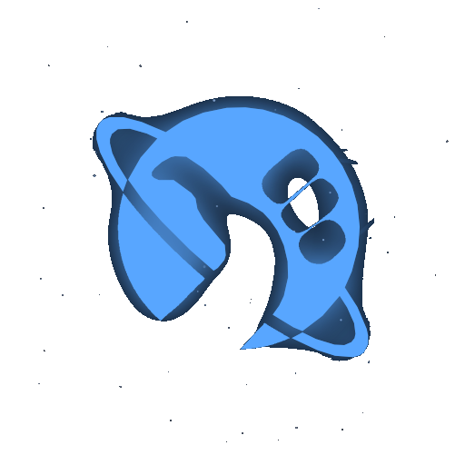
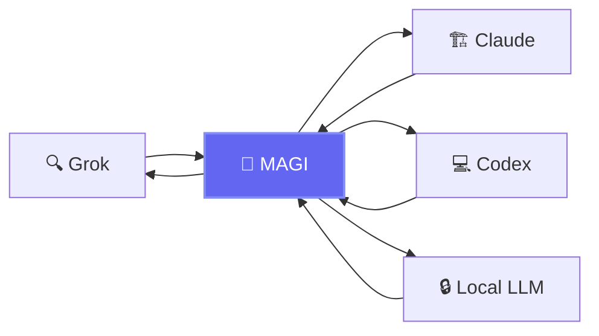
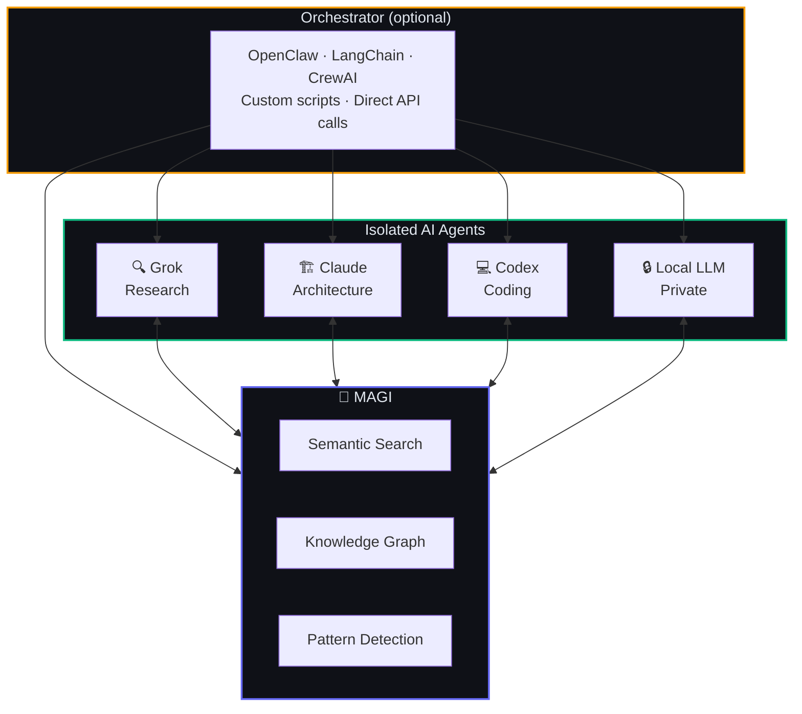

<p align="center">
  
</p>
<h1 align="center">MAGI</h1>
<p align="center"><strong>Multi-Agent Graph Intelligence</strong></p>
<p align="center">Universal memory for AI agents. Self-hosted. Multi-protocol. Agent-agnostic.</p>
<p align="center"><em>Don't Panic.</em></p>

<p align="center">
  <a href="https://github.com/j33pguy/magi/wiki">Wiki</a> ·
  <a href="https://github.com/j33pguy/magi/wiki/Getting-Started">Quick Start</a> ·
  <a href="https://github.com/j33pguy/magi/wiki/REST-API-Reference">API Docs</a> ·
  <a href="https://github.com/j33pguy/magi/wiki/Architecture">Architecture</a>
</p>

---

Your AI agents are brilliant — and completely amnesiac. Grok discovers a breaking API change. Claude doesn't know about it when reviewing your code. Codex builds a module. Your local LLM has no idea it exists.

**MAGI gives all your agents a shared brain.**



## The Bigger Picture

MAGI is the memory layer. Plug it into any orchestration setup — or use it standalone.



Route work however you want — [OpenClaw](https://github.com/openclaw/openclaw), LangChain, CrewAI, a bash script, or direct API calls. MAGI doesn't care how agents get their tasks. It just makes sure every agent has access to what every other agent has done.

## Why MAGI?

- **Semantic Search** — Hybrid vector + BM25 with local ONNX embeddings
- **Knowledge Graph** — Auto-linked memories with D3.js visualization
- **Pattern Detection** — Surfaces behavioral insights across all agents
- **Multi-Protocol** — MCP · gRPC · REST · Web UI
- **Self-Hosted** — Your data, your hardware. Zero cloud dependencies.
- **Agent-Agnostic** — Works with any agent that speaks HTTP, gRPC, or MCP

## Quick Start

```bash
# Docker
docker run -d -p 8302:8302 -p 8080:8080 -e MEMORY_BACKEND=sqlite ghcr.io/j33pguy/magi:latest

# Binary
MEMORY_BACKEND=sqlite ./magi --http-only

# From source
git clone https://github.com/j33pguy/magi.git && cd magi && make build
```

## Use It

```bash
# Grok stores a finding
curl -X POST http://localhost:8302/remember \
  -H "Authorization: Bearer $TOKEN" \
  -d '{"content": "v3 API deprecates /users", "project": "myapp", "type": "decision", "speaker": "grok"}'

# Claude recalls it during code review
curl -X POST http://localhost:8302/recall \
  -d '{"query": "API changes", "limit": 5}'
```

## What's Inside

| Feature | Description |
|---------|-------------|
| 20 MCP tools | Full agent integration via stdio |
| REST + gRPC APIs | Any language, any platform |
| Web Dashboard | Browse, search, graph, analyze |
| Knowledge Graph | Auto-linked with typed relationships |
| Pattern Analyzer | Detects preferences, habits, decision styles |
| 10 Memory Types | Decisions, lessons, incidents, preferences, and more |
| Pluggable Storage | SQLite · Turso · PostgreSQL · Supabase (planned) |

## vs. Alternatives

| | MAGI | mem0 | Zep | ChromaDB |
|-|------|------|-----|----------|
| Knowledge graph | ✅ | ❌ | ❌ | ❌ |
| Pattern detection | ✅ | ❌ | ❌ | ❌ |
| Typed memories | ✅ | ❌ | Partial | ❌ |
| Orchestrator-agnostic | ✅ | ❌ | ❌ | ❌ |
| Self-hosted | ✅ | Cloud-first | ✅ | ✅ |
| Multi-protocol | MCP+gRPC+REST | REST | REST | REST |
| Web UI | ✅ | ❌ | ❌ | ❌ |

## Docs

**[Full documentation in the Wiki →](https://github.com/j33pguy/magi/wiki)**

[Getting Started](https://github.com/j33pguy/magi/wiki/Getting-Started) · [Architecture](https://github.com/j33pguy/magi/wiki/Architecture) · [MCP Tools](https://github.com/j33pguy/magi/wiki/MCP-Tools-Reference) · [REST API](https://github.com/j33pguy/magi/wiki/REST-API-Reference) · [Multi-Agent Setup](https://github.com/j33pguy/magi/wiki/Multi-Agent-Setup) · [Knowledge Graph](https://github.com/j33pguy/magi/wiki/Knowledge-Graph) · [Deployment](https://github.com/j33pguy/magi/wiki/Deployment-Guide) · [Config](https://github.com/j33pguy/magi/wiki/Configuration) · [FAQ](https://github.com/j33pguy/magi/wiki/FAQ)

## In Memory Of

This project is dedicated to **Mary Margaret** — a dear friend who believed that the things worth remembering are the things that connect us. MAGI carries her spirit: nothing important should ever be forgotten.

## License

MIT
