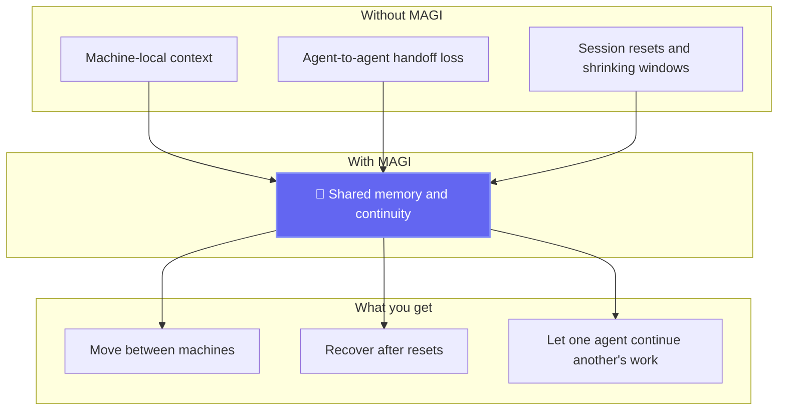
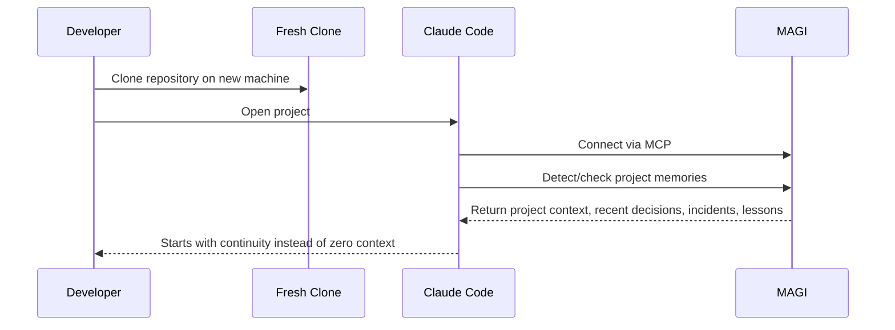
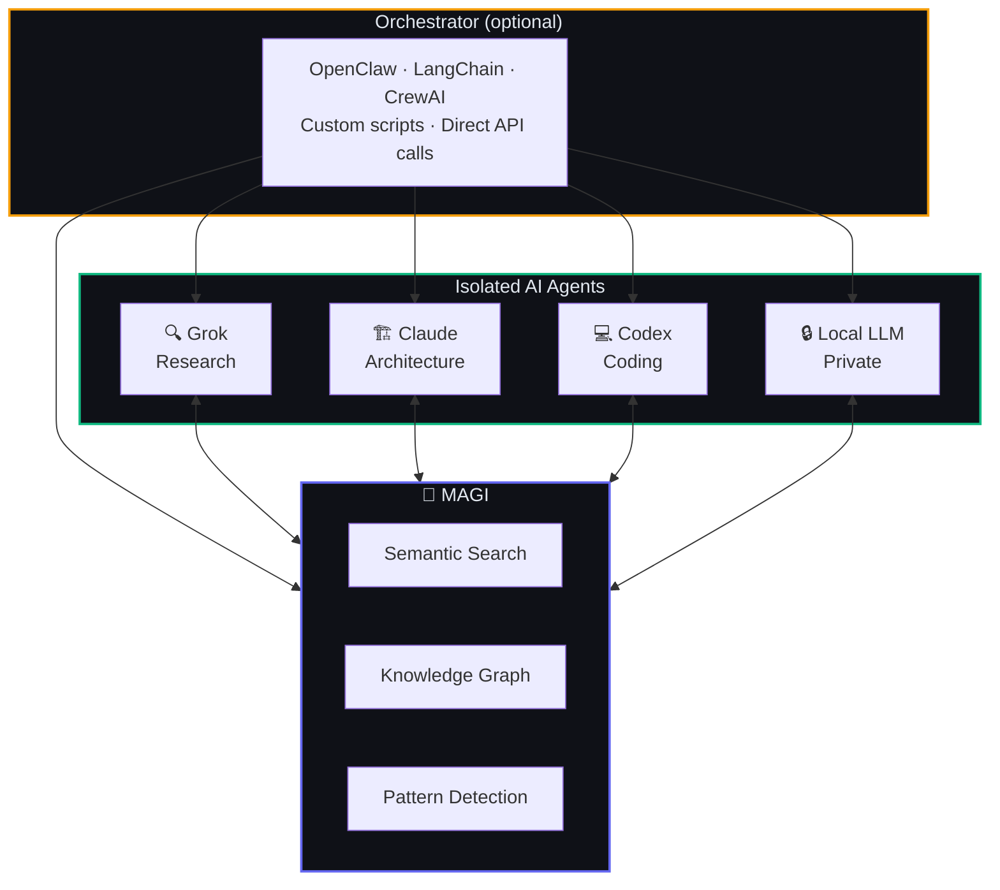
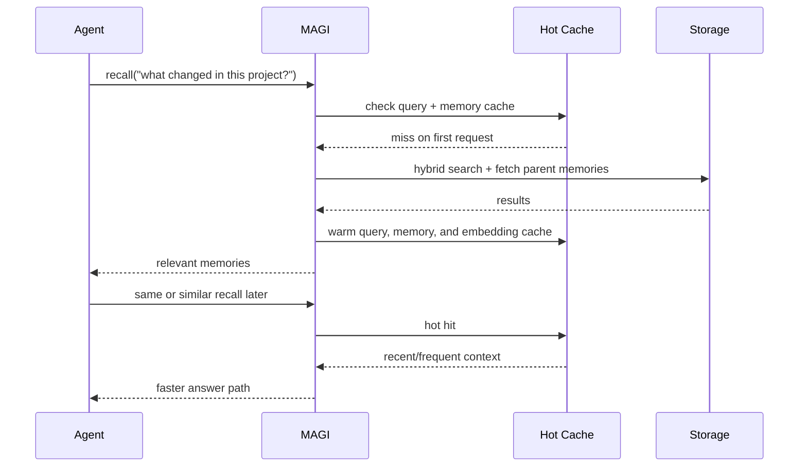
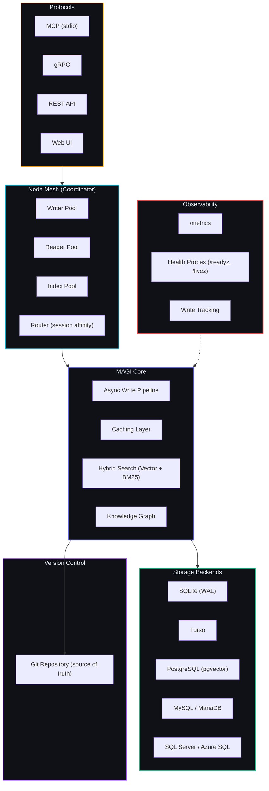

<p align="center">
  
</p>
<h1 align="center">MAGI</h1>
<p align="center"><strong>Multi-Agent Graph Intelligence</strong></p>
<p align="center">Shared memory and continuity for isolated AI agents. Self-hosted. Multi-protocol. Agent-agnostic.</p>

<p align="center">
  <a href="https://github.com/j33pguy/magi/wiki">Wiki</a> ·
  <a href="https://github.com/j33pguy/magi/wiki/Getting-Started">Quick Start</a> ·
  <a href="docs/onboarding.md">Onboarding</a> ·
  <a href="docs/task-queue.md">Task Queue</a> ·
  <a href="https://github.com/j33pguy/magi/wiki/REST-API-Reference">API Docs</a> ·
  <a href="https://github.com/j33pguy/magi/wiki/Architecture">Architecture</a> ·
  <a href="docs/strategy-rollup.md">Strategy</a> ·
  <a href="docs/auth-architecture.md">Auth</a>
</p>

---

## Project Status

MAGI is still a work in progress.

It is already useful, and it is moving toward a production-ready stable product as real-world testing and user feedback continue to harden it. I will test as thoroughly as I can, but things may break.

Do not run MAGI in production unless you understand the risks, validate it in your own environment, and are prepared for failure modes, backups, and recovery.

---

## What's New in v0.2.0

- **Distributed Node Mesh** — Writer, Reader, Index, and Coordinator node types with goroutine pool routing, session affinity for read-your-writes consistency, zero overhead in embedded mode (PR #74)
- **Metrics Endpoint** — 9 metrics: write/search latency, embedding duration, queue depth, memory count, session count, cache hit/miss, git commits. Scrape `/metrics` (PR #73)
- **Health Probes** — `/readyz` and `/livez` for Kubernetes, expanded `/health` with DB status, uptime, memory count, git status (PR #73)
- **Write Tracking Helpers** — `TrackTask`, `TrackDecision`, `TrackConversation` for production dogfooding (PR #73)
- **MCP Config Generator** — `magi mcp-config` outputs ready-to-paste JSON for Claude/Codex (PR #73)
- **Chaos Testing** — Concurrent writes, search-during-ingestion, kill recovery, cache overflow (PR #73)
- **SQL Server Backend** — Full support for SQL Server / Azure SQL (PR #71)

---

## What's New in v0.3.0

- **Separate Task Queue** — tasks now live outside the memory stack with explicit statuses, task events, and memory references for orchestrator/worker coordination
- **Task MCP Tools** — agents can now `create_task`, `list_tasks`, `get_task`, `update_task`, `add_task_event`, and `list_task_events`
- **Web UI Auth** — Web UI now enforces Bearer auth via `MAGI_API_TOKEN` and respects memory visibility
- **UI Toggle** — `MAGI_UI_ENABLED` enables or disables the web UI server
- **Async Writes Now Live** — The async write pipeline is fully functional with `MAGI_ASYNC_WRITES=true`
- **gRPC Graph Parity** — `LinkMemories` and `GetRelated` RPCs are now implemented
- **PostgreSQL + MySQL Factory Wiring** — Backend factory now includes PostgreSQL and MySQL
- **Unified Remember Enrichment** — classify, secret detection, dedup, and contradiction checks now run consistently across MCP, gRPC, and REST
- **External Secret Store Support** — remember flows can now externalize detected secrets into Vault-backed KV storage instead of forcing raw secrets into memory
- **New remember Service Layer** — `internal/remember` centralizes write enrichment logic
- **stdio-Only MCP Mode** — `--mcp-only` runs MCP stdio without HTTP/gRPC servers for agent subprocess integrations

---

Your AI agents are brilliant, but their context is fragile. Switch computers and the memory stays behind. Lose a session to provider overload or context-window shrinkage and the agent starts from zero. Hand work from Grok to Claude to Codex and too much of the why gets lost in transit.

**MAGI gives isolated agents a shared memory and continuity layer.**



## What MAGI Solves

- **Cross-machine continuity** — move between laptops, workstations, servers, or containers without dragging hidden agent state around by hand.
- **Cross-agent handoffs** — let research, architecture, coding, and ops agents share context without copy-pasting entire prompts forward.
- **Session resilience** — recover after provider overloads, model swaps, context-window shrinkage, or interrupted sessions by pointing agents back at durable memory.
- **Project rehydration after clone** — MAGI already auto-detects project scope from git context, and that groundwork makes it possible to reconnect a fresh clone to the right project memory instead of starting from zero.
- **Portable self-hosted memory** — keep your memory layer on your hardware and in your stack instead of inside a single vendor tool.
- **Enterprise-capable deployment** — start with one container and SQLite, then grow into PostgreSQL and role-separated worker containers when scale demands it.

## Why This Exists

MAGI started from a simple problem: agent memory was trapped on one machine. Switching computers meant losing continuity or digging through local agent files to reconstruct context. From there, the problem widened: isolated agents, isolated sessions, and isolated machines all create the same failure mode.

MAGI solves that by giving agents one durable place to store findings, decisions, lessons, incidents, conversations, and project context so they can rehydrate and continue work instead of starting over.

## The "It Just Clicks" Experience

Once MAGI is running, the first real workflow already looks pretty simple:

1. Point Claude Code, Codex, or another MCP-capable agent at MAGI.
2. Optionally install `magi-sync` on each isolated machine and enroll it once.
3. Let `magi-sync` ingest selected local Claude context into the shared MAGI server.
4. Let MAGI auto-detect the current project from the git remote when possible.
5. Let the agent check MAGI for recent project memories before starting work.
6. Let the agent store decisions, incidents, lessons, and progress as it goes.

That means a repo you already worked on can feel familiar after a fresh clone on another machine: the project is detected, relevant context is available, and the agent can rehydrate instead of starting cold. The deeper “fresh clone instantly feels warm” path is the direction this current project detection plus `magi-sync` ingestion work is building toward.



## The Bigger Picture

MAGI is the memory layer, not the orchestrator. Plug it into any orchestration setup, any internal toolchain, or use it standalone.



Route work however you want — [OpenClaw](https://github.com/openclaw/openclaw), LangChain, CrewAI, a bash script, or direct API calls. MAGI doesn't care how agents get their tasks. It just makes sure every agent has access to what every other agent has done.

MAGI can now also host the shared task queue itself when you want that coordination surface close to memory, but tasks stay separate from memories so progress tracking does not pollute recall results.

## Who It's For

- **Solo builders** who want their agent context to follow them across multiple computers.
- **Multi-agent users** who need Claude, Codex, Cursor, GPT, Grok, or local models to pick up where each other left off.
- **Self-hosters** who want zero cloud dependency by default and control over storage, deployment, and audit history.
- **Teams and enterprises** that need a shared memory layer that can plug into existing infrastructure and grow from a single container to distributed services.

## Easy First Win

The easiest way to understand MAGI is to point one isolated agent at it and feel the difference.

- Run MAGI once.
- Add the MAGI MCP server to Claude Code or another MCP client.
- Start storing and recalling memories through the same shared server.
- On the next machine, point the agent at the same MAGI instance and pick up where you left off.

That first win matters: you do not need a giant multi-agent system to benefit. Even one agent across multiple machines is enough to make MAGI useful.

## Why MAGI?

- **Git-Versioned Memory** — Every mutation is a git commit. Full history, diffs, and rollback for every memory. The database is a derived index; the git repo is the source of truth. No other AI memory system has this.
- **Distributed Node Mesh** — Writer/Reader/Index/Coordinator pools with session affinity. Zero-overhead embedded mode today, clean path to gRPC-connected worker containers as load grows.
- **Separate Task Queue** — shared orchestrator/worker task tracking with statuses, comms, issues, lessons, pitfalls, successes, and linked memories, all outside the main memory stack
- **Semantic Search** — Hybrid vector + BM25 with local ONNX embeddings
- **TurboQuant Compression** — Optional Google-inspired PolarQuant compression path for embedding storage experiments
- **Knowledge Graph** — Auto-linked memories with D3.js visualization
- **Pattern Detection** — Surfaces behavioral insights across all agents
- **Async Write Pipeline** — Returns 202 Accepted in <10ms. Worker pool with batch INSERT for throughput.
- **Metrics Endpoint** — Write/search latency, queue depth, cache stats, embedding duration. Scrape `/metrics`.
- **Health Probes** — `/readyz`, `/livez`, expanded `/health`. Kubernetes-ready.
- **Multi-Protocol** — MCP · gRPC · REST · Web UI
- **Multi-Backend** — SQLite · Turso · PostgreSQL (pgvector) · MySQL/MariaDB · SQL Server/Azure SQL
- **Self-Hosted** — Your data, your hardware. Zero cloud dependencies.
- **Agent-Agnostic** — Works with any agent that speaks HTTP, gRPC, or MCP

## Current Direction

The next major product and architecture themes are captured here:

- [Strategy Rollup](docs/strategy-rollup.md)
- [Auth Architecture](docs/auth-architecture.md)
- [Migration Strategy](docs/migration-strategy.md)
- [magi-sync Design](docs/magi-sync-design.md)
- [Task Queue](docs/task-queue.md)
- [Roadmap](docs/roadmap.md)

These cover the path from:

- one self-hosted machine to multiple machines
- one isolated agent to multi-agent continuity
- one container to role-separated scale-out
- basic visibility to authenticated user/machine/agent-aware access control
- additive schema changes to safer major-version database evolution

## Quick Start

```bash
# Docker (MEMORY_BACKEND: sqlite (default) | turso | postgres | mysql | sqlserver)
docker run -d -p 8302:8302 -p 8080:8080 -e MEMORY_BACKEND=sqlite ghcr.io/example-org/magi:latest

# Binary
MEMORY_BACKEND=postgres MAGI_ASYNC_WRITES=true MAGI_CACHE_ENABLED=true ./magi --http-only

# From source
git clone https://github.com/j33pguy/magi.git && cd magi && make build

# Recommended first-run defaults
export MAGI_ASYNC_WRITES=true
export MAGI_CACHE_ENABLED=true

# Optional: enable TurboQuant-style embedding compression
export MAGI_TURBOQUANT_ENABLED=true
export MAGI_TURBOQUANT_BITS=4

# Generate MCP config for Claude/Codex
magi mcp-config
```

Recommended deployment path:

- **Quickstart**: one container + SQLite
- **Production**: MAGI + PostgreSQL
- **Scale-out**: role-separated containers over network transport with PostgreSQL

### Verify It's Running

```bash
# Liveness
curl http://localhost:8302/livez

# Readiness (checks DB)
curl http://localhost:8302/readyz

# Full health (DB status, uptime, memory count, git status)
curl http://localhost:8302/health

# Metrics endpoint
curl http://localhost:8302/metrics
```

## Fastest Path To First Useful Recall

If you want the shortest route from "installed" to "this is already helping," use this flow:

1. Run MAGI with `MAGI_ASYNC_WRITES=true` and `MAGI_CACHE_ENABLED=true`.
2. Paste the output of `magi mcp-config` into Claude Code, Codex, or another MCP client.
3. Let the agent call `recall` before it starts work on a project.
4. Let the agent call `remember` for decisions, incidents, lessons, and project context as it works.
5. If you move between machines, install `magi-sync`, enroll it once, and point both machines at the same MAGI server.

That first loop is the quickest way to feel the value: the same agent stops starting cold, and the second recall is usually faster because MAGI now keeps the hot path warm.



## Use It

```bash
# Grok stores a finding
curl -X POST http://localhost:8302/remember \
  -H "Authorization: Bearer $TOKEN" \
  -d '{"content": "v3 API deprecates /users", "project": "myapp", "type": "decision", "speaker": "grok"}'

# Claude recalls it during code review
curl -X POST http://localhost:8302/recall \
  -H "Authorization: Bearer $TOKEN" \
  -d '{"query": "API changes", "top_k": 5}'
```

## What's Inside

| Feature | Description |
|---------|-------------|
| Distributed Node Mesh | Writer/Reader/Index/Coordinator pools, session affinity, zero-overhead embedded mode. |
| Git-Backed Memory Versioning | Every mutation = git commit. Full history, diffs, rollback. DB is a derived index. |
| Async Write Pipeline | 202 Accepted in <10ms. Worker pool with batch INSERT for high throughput. |
| Caching Layer | Hot query cache for repeated recall, LRU memory cache for recently/frequently fetched memories, embedding cache to skip repeated ONNX work. |
| Metrics Endpoint | 9 metrics: write/search latency, queue depth, cache stats, embedding duration, git commits. |
| Health Probes | `/readyz`, `/livez`, expanded `/health` with DB status, uptime, memory count, git status. |
| Write Tracking | TrackTask, TrackDecision, TrackConversation helpers for production dogfooding. |
| 17 MCP tools | Full agent integration via stdio |
| REST + gRPC APIs | Any language, any platform |
| Web Dashboard | Browse, search, graph, analyze |
| Knowledge Graph | Auto-linked with typed relationships |
| Pattern Analyzer | Detects preferences, habits, decision styles |
| 10 Memory Types | Decisions, lessons, incidents, preferences, and more |
| Pluggable Storage | SQLite · Turso · PostgreSQL (pgvector) · MySQL/MariaDB · SQL Server/Azure SQL |
| Chaos Testing | Concurrent writes, search-during-ingestion, kill recovery, cache overflow. |

## vs. Alternatives

| | MAGI | mem0 | Zep | ChromaDB |
|-|------|------|-----|----------|
| Git versioning | ✅ | ❌ | ❌ | ❌ |
| Distributed node mesh | ✅ | ❌ | ❌ | ❌ |
| Knowledge graph | ✅ | ❌ | ❌ | ❌ |
| Pattern detection | ✅ | ❌ | ❌ | ❌ |
| Async pipeline | ✅ | ❌ | ❌ | ❌ |
| Metrics endpoint | ✅ | ❌ | ❌ | ❌ |
| Health probes (k8s) | ✅ | ❌ | ❌ | ❌ |
| Typed memories | ✅ | ❌ | Partial | ❌ |
| Orchestrator-agnostic | ✅ | ❌ | ❌ | ❌ |
| Self-hosted | ✅ | Cloud-first | ✅ | ✅ |
| Multi-protocol | MCP+gRPC+REST | REST | REST | REST |
| Storage backends | SQLite, Turso, PostgreSQL, MySQL, SQL Server | Qdrant/Pinecone | Postgres | Chroma |
| Web UI | ✅ | ❌ | ❌ | ❌ |

## Performance

| Metric | Before | After |
|--------|--------|-------|
| Write latency | ~3,000ms (sync) | <10ms (async pipeline, 202 Accepted) |
| Search | Sequential vector + FTS | Parallel vector + FTS via errgroup |
| Query cache | None | Repeated recall results stay warm for a short TTL |
| Hot memory cache | None | Recently recalled and frequently fetched memories stay in LRU |
| Embedding cache | Recompute every time | Skip ONNX for identical recall and ingest content |
| SQLite mode | Default | WAL mode + connection pooling |

## Architecture

MAGI is optimized for a fast single-node deployment first, then scales into specialized containers when workload grows. Start with one container and SQLite or PostgreSQL; scale out by splitting API, writer, reader, index, and embedder roles.



Recommended deployment path:

- `Quickstart`: single container + SQLite + async writes
- `Standard`: single MAGI container + PostgreSQL
- `Scale-out`: role-separated containers over network transport with PostgreSQL

## Docs

**[Full documentation in the Wiki →](https://github.com/j33pguy/magi/wiki)**

[Getting Started](https://github.com/j33pguy/magi/wiki/Getting-Started) · [Architecture](https://github.com/j33pguy/magi/wiki/Architecture) · [MCP Tools](https://github.com/j33pguy/magi/wiki/MCP-Tools-Reference) · [REST API](https://github.com/j33pguy/magi/wiki/REST-API-Reference) · [Multi-Agent Setup](https://github.com/j33pguy/magi/wiki/Multi-Agent-Setup) · [Knowledge Graph](https://github.com/j33pguy/magi/wiki/Knowledge-Graph) · [Deployment](https://github.com/j33pguy/magi/wiki/Deployment-Guide) · [Config](https://github.com/j33pguy/magi/wiki/Configuration) · [FAQ](https://github.com/j33pguy/magi/wiki/FAQ)

## In Memory Of

This project is dedicated to **Mary Margaret** — a dear friend who believed that the things worth remembering are the things that connect us. MAGI carries her spirit: nothing important should ever be forgotten.

## Docker Compose

```bash
# Build the binary into the repo root for the Dockerfile build context
CGO_ENABLED=1 go build -o magi .

# Build and start
docker compose up --build -d
```

The compose file runs the SQLite backend by default and exposes:
- `8080` Web UI
- `8300` gRPC
- `8301` gateway
- `8302` REST API

Persistent data (SQLite DB and ONNX models) is stored in the named volume `magi-data` mounted at `/data`.

## License

[Elastic License 2.0 (ELv2)](LICENSE) — free to use, modify, and self-host. Cannot be offered as a managed/hosted service without a commercial license from the author.
