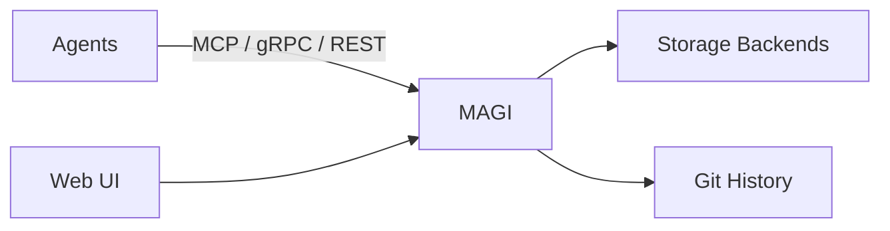

<p align="center">
  
</p>
<h1 align="center">MAGI</h1>
<p align="center"><strong>Multi-Agent Graph Intelligence</strong></p>
<p align="center">Shared memory and continuity for isolated AI agents. Self-hosted. Multi-protocol. Model-agnostic.</p>

<p align="center">
  
  
  
  
  
</p>

<p align="center">
  <a href="https://github.com/j33pguy/magi/wiki">Wiki</a> ·
  <a href="https://github.com/j33pguy/magi/wiki/Getting-Started">Quick Start</a> ·
  <a href="https://github.com/j33pguy/magi/wiki/REST-API-Reference">API Docs</a> ·
  <a href="https://github.com/j33pguy/magi/wiki/MCP-Tools-Reference">MCP Tools</a> ·
  <a href="https://github.com/j33pguy/magi/wiki/Architecture">Architecture</a> ·
  <a href="https://github.com/j33pguy/magi/wiki/Deployment-Guide">Deployment</a>
</p>

---

## Why MAGI?

Agents are powerful, but their memory is fragile and fragmented. MAGI gives any agent a durable, shared memory layer that survives model switches, provider outages, and shrinking context windows. Host it on your own hardware, point every agent at the same server, and your context persists across sessions and machines. No vendor lock-in, no rebuilds, no cold starts.

## Features

- **Model-agnostic memory** — switch providers or local models without losing history or decisions.
- **Self-hosted** — your data stays on your hardware with zero cloud dependency.
- **Multi-protocol** — MCP (stdio), gRPC, REST API, and Web UI — 24 MCP tools.
- **Shared memory for isolated agents** — research, architecture, and coding agents all read and write to the same context.
- **Session resilience** — recover after provider outages or context resets.
- **Cross-machine continuity** — laptop to desktop to server without losing state.
- **Backend-agnostic** — works with SQLite, Turso, PostgreSQL, MySQL/MariaDB, SQL Server.
- **Git-backed history** — every mutation is a commit with diffs and rollback.

## What MAGI Solves

- **Cross-agent handoffs** — transfer context without copying giant prompts between tools.
- **Cold-starts after resets** — resume after context loss or provider failure.
- **Context trapped on one machine** — keep a single memory layer across laptops, desktops, and servers.

## Quick Start

```bash
git clone https://github.com/j33pguy/magi.git
cd magi
docker compose up -d
export MAGI_HTTP_URL=<MAGI_HTTP_URL>
curl "$MAGI_HTTP_URL/health"
```

## MCP Config

```bash
magi mcp-config
```

## Use It

```bash
export MAGI_HTTP_URL=<MAGI_HTTP_URL>
export MAGI_API_TOKEN=<MAGI_API_TOKEN>
curl -X POST "$MAGI_HTTP_URL/remember" -H "Authorization: Bearer $MAGI_API_TOKEN" -d '{"content":"API v3 deprecates /users","project":"demo","type":"decision","speaker":"agent-a"}'
curl -X POST "$MAGI_HTTP_URL/remember" -H "Authorization: Bearer $MAGI_API_TOKEN" -d '{"content":"Migrate clients before Q4","project":"demo","type":"lesson","speaker":"agent-b"}'
curl -X POST "$MAGI_HTTP_URL/recall" -H "Authorization: Bearer $MAGI_API_TOKEN" -d '{"query":"API changes","top_k":5}'
curl -X POST "$MAGI_HTTP_URL/recall" -H "Authorization: Bearer $MAGI_API_TOKEN" -d '{"query":"recent lessons","top_k":5}'
```

## Architecture



## vs. Alternatives

| | MAGI | mem0 | Zep | ChromaDB |
|-|------|------|-----|----------|
| Git versioning | ✅ | ❌ | ❌ | ❌ |
| Distributed node mesh | ✅ | ❌ | ❌ | ❌ |
| Knowledge graph | ✅ | ❌ | ❌ | ❌ |
| Pattern detection | ✅ | ❌ | ❌ | ❌ |
| Async pipeline | ✅ | ❌ | ❌ | ❌ |
| Metrics endpoint | ✅ | ❌ | ❌ | ❌ |
| Health probes (k8s) | ✅ | ❌ | ❌ | ❌ |
| Typed memories | ✅ | ❌ | Partial | ❌ |
| Orchestrator-agnostic | ✅ | ❌ | ❌ | ❌ |
| Self-hosted | ✅ | Cloud-first | ✅ | ✅ |
| Multi-protocol | MCP+gRPC+REST | REST | REST | REST |
| Storage backends | SQLite, Turso, PostgreSQL, MySQL, SQL Server | Qdrant/Pinecone | Postgres | Chroma |
| Web UI | ✅ | ❌ | ❌ | ❌ |

## Docs

**[Full documentation in the Wiki →](https://github.com/j33pguy/magi/wiki)**

[Getting Started](https://github.com/j33pguy/magi/wiki/Getting-Started) · [Architecture](https://github.com/j33pguy/magi/wiki/Architecture) · [MCP Tools](https://github.com/j33pguy/magi/wiki/MCP-Tools-Reference) · [REST API](https://github.com/j33pguy/magi/wiki/REST-API-Reference) · [Multi-Agent Setup](https://github.com/j33pguy/magi/wiki/Multi-Agent-Setup) · [Knowledge Graph](https://github.com/j33pguy/magi/wiki/Knowledge-Graph) · [Deployment](https://github.com/j33pguy/magi/wiki/Deployment-Guide) · [Config](https://github.com/j33pguy/magi/wiki/Configuration) · [FAQ](https://github.com/j33pguy/magi/wiki/FAQ)

## In Memory Of

This project is dedicated to **Mary Margaret** — a dear friend who believed that the things worth remembering are the things that connect us. MAGI carries her spirit: nothing important should ever be forgotten.

## ⚠️ Stability

MAGI is not production-ready yet. It is useful today and improving fast, but expect breaking changes, rough edges, and the occasional surprise until a stable release is tagged. Back up your data, test in your own environment, and plan for things to break.

## License

[Elastic License 2.0 (ELv2)](LICENSE) — free to use, modify, and self-host. Cannot be offered as a managed/hosted service without a commercial license from the author.
