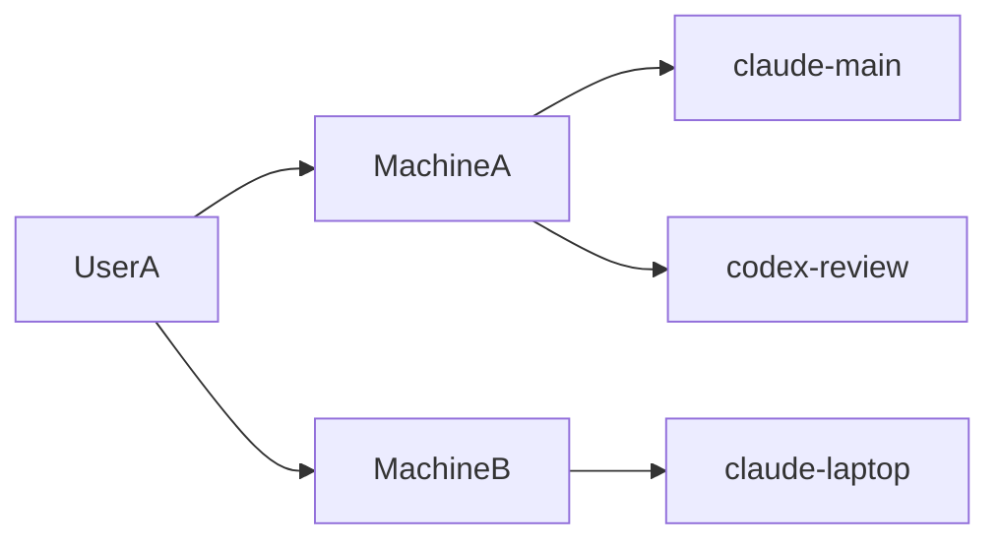
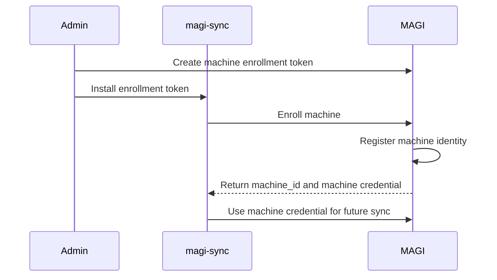
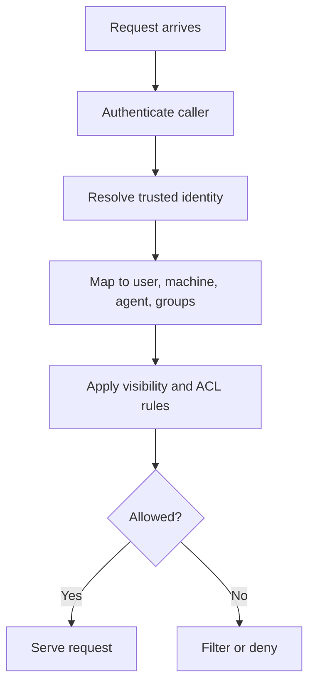

# Authentication Architecture

MAGI needs to authenticate three distinct identities:

- `user`
- `machine`
- `agent`

That lets MAGI reason about:

- who is asking
- which device or container is asking
- which isolated agent is acting

## Goals

- authenticate humans and machines separately
- support self-hosted and enterprise deployments
- make `magi-sync` safe for remote use
- derive trusted identity server-side
- support owner/viewer/group-based memory access

## Non-Goals

- do not trust raw caller-supplied identity headers as the final source of truth
- do not force browser login flows onto background sync agents
- do not require cloud identity providers for local-only use

## Identity Model

Recommended identity fields:

- `user_id`
- `machine_id`
- `agent_id`
- `agent_name`
- `agent_type`
- `groups`
- `project`
- `auth_method`
- `issued_at`
- `last_seen_at`

## Two Authentication Lanes

### Human lane

For:

- web UI
- admin API
- CLI access
- human-triggered API calls

Recommended auth:

- OIDC
- Authentik is a strong fit here

### Machine lane

For:

- `magi-sync`
- worker containers
- CI runners
- background services

Recommended auth:

- bootstrap token for enrollment
- per-machine credential after enrollment
- evolve toward mTLS or short-lived signed machine tokens

## Trust Model

MAGI should not trust:

- `X-MAGI-User`
- `X-MAGI-Groups`
- `X-MAGI-Machine`
- `X-MAGI-Agent`

unless those are set by:

- MAGI itself
- a trusted auth proxy
- a verified machine-credential flow

## Secret Handling

Secret material should be treated as a separate trust boundary from normal memory content.

Recommended model:

- detect likely secrets during `remember` flows
- reject them by default
- optionally externalize them to a managed KV backend before saving memory content
- resolve stored references only through authenticated server-side flows

The first implemented backend is HashiCorp Vault KV v2. The backend interface is intentionally generic so additional enterprise secret stores can be added without changing the memory APIs.

## Recommended Near-Term Stack

### Self-hosted practical path

- Tailscale for remote transport
- Authentik/OIDC for humans
- per-machine API tokens for `magi-sync`

### Enterprise path

- OIDC for humans
- machine enrollment
- mTLS or short-lived machine credentials
- server-derived claims for user, machine, and groups

## Enrollment Flow

Machine registration should capture:

- `machine_id`
- `display_name`
- `owner_user`
- `groups`
- `allowed_sources`
- `default_visibility`

## Runtime Request Flow

## Authorization Model

MAGI should combine:

- memory visibility
- owner tags
- viewer tags
- viewer group tags
- authenticated caller identity

Recommended visibility levels:

- `private`
- `internal`
- `team`
- `shared`
- `public`

Recommended ACL tags:

- `owner:UserA`
- `viewer:UserB`
- `viewer_group:platform`

## Endpoint Split

Separate human and machine traffic.

Recommended layout:

- `memory.example.com`
  - web UI
  - human API
  - OIDC/Auth proxy
- `sync.memory.example.com`
  - `magi-sync` ingress
  - machine credentials
  - non-browser auth path
- `/health`, `/ready`, `/livez`
  - unauthenticated or infra-scoped access

## Why Not Raw SSH Keys Everywhere

SSH keys are useful for:

- machine enrollment
- signing a one-time registration challenge
- proving device possession

SSH keys are less ideal as the only runtime auth mechanism because:

- rotation is clumsier
- policy mapping is less ergonomic
- mixed human and machine auth gets awkward

Use SSH-style proof for bootstrap if desired, but prefer issued credentials or mTLS for steady-state runtime auth.

## Recommended Rollout Phases

### Phase 1

- Authentik/OIDC for human UI
- per-machine API tokens for `magi-sync`
- server-side identity mapping
- tag-based ACL enforcement on HTTP query paths

Implemented foundation:

- shared auth resolver for HTTP and gRPC
- DB-backed machine credential lookup
- admin enrollment and revoke endpoints
- authenticated machine identity mapped to user, machine, agent, and groups
- access-aware recall/list/search filtering for machine callers

### Phase 2

- machine registry and enrollment API
- dedicated sync endpoint
- trusted server-derived machine and group claims
- explicit owner/viewer policy in write APIs

### Phase 3

- mTLS or short-lived machine credentials
- admin UI for machine lifecycle and revocation
- MCP access parity
- audit trails and policy introspection
