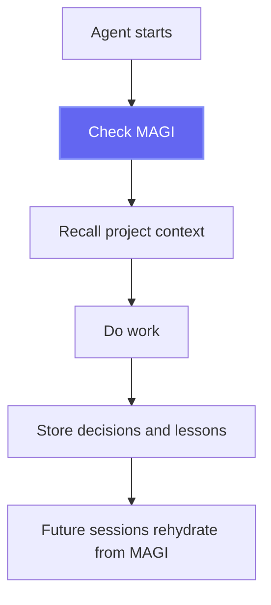

# CLAUDE.md Companion for MAGI

This document is meant to be copied into project-level `CLAUDE.md` files for isolated agents such as Claude Code. It tells the agent to treat MAGI as the durable memory system for the project.

## Purpose

Use MAGI as the shared memory and continuity layer for this project.

- Before starting work, check MAGI for project context, decisions, incidents, lessons, and recent progress.
- During work, store important findings and decisions in MAGI.
- After interruptions, resets, or context loss, rehydrate from MAGI instead of starting from zero.

## Suggested `CLAUDE.md` Block

```markdown
## MAGI Memory Rules

This project uses MAGI as its durable memory layer.

Before starting any substantial task:
1. Identify or confirm the current project key.
2. Check MAGI for recent project context, decisions, incidents, lessons, and relevant prior work.
3. If sync status is available and stale, sync MAGI before proceeding.
4. Use recalled context to guide planning and implementation.

During work:
1. Store important decisions with reasoning.
2. Store incidents, fixes, and lessons learned.
3. Store meaningful progress updates when they would help a future session or another agent continue the work.
4. Prefer structured memories with project, type, speaker, tags, and clear summaries when available.

After resets, degraded sessions, or context loss:
1. Re-check MAGI for project context.
2. Rehydrate from memory before asking the user to reconstruct prior work.

Behavioral rule:
- Do not assume local session state is the source of truth.
- Treat MAGI as the shared continuity layer for this project.
```

## MCP-Oriented Variant

If you want a version that is more explicit about MCP resources and tools:

```markdown
## MAGI MCP Workflow

This project uses MAGI for shared memory.

Before starting a task:
1. Read `memory://context` if available.
2. Check project-specific MAGI memories relevant to the task.
3. If `sync_now` is available and the project memory may be stale, run it before proceeding.

While working:
1. Store important decisions, incidents, lessons, and project context in MAGI.
2. Use project tagging consistently.
3. Prefer storing memory as you go instead of waiting until context is lost.

After interruption or reset:
1. Re-read MAGI context and recent project memories.
2. Reconstruct working state from MAGI before asking the user to restate everything.
```

## What This Helps With

- fresh clones on another machine
- switching between multiple computers
- handoffs between Claude Code and other agents
- recovery after overloads or session resets
- keeping project decisions durable outside local hidden files


