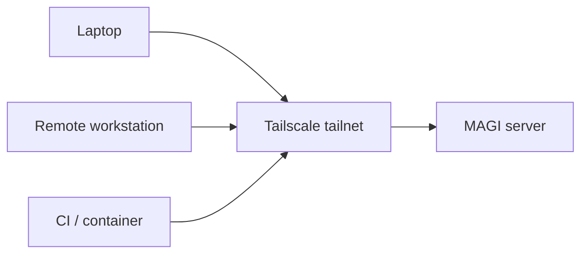

# Deployment Guide

## Production Notice

MAGI is still a work in progress.

It is usable today, but it should not be treated as a finished, production-ready stable product yet. Real-world usage and bug reports are part of how it will get there, and that means some behavior may still change or break under load or in edge cases.

If you deploy MAGI in production, do it with clear eyes: test it first, understand the risks, keep backups, and plan for rollback and recovery.

## Upgrade Safety

Schema migrations run automatically on startup, which is fine for additive changes and small backend-specific DDL updates.

For larger releases that reshape how memories are stored or interpreted, operators should assume a safer upgrade posture:

1. back up the database first
2. preserve git-backed memory history if enabled
3. read the release notes for any required backfill or operator-managed migration step
4. test the upgrade in a staging or lab environment before production

The longer-term migration policy is documented in [migration-strategy.md](migration-strategy.md).

## Prerequisites

- Go 1.25+ with CGO enabled
- ONNX Runtime shared library installed
- A supported backend:
  - SQLite for the simplest self-hosted setup
  - PostgreSQL for scaled/containerized deployments
  - Turso for sync-oriented multi-device setups

### Installing ONNX Runtime

**macOS:**
```bash
brew install onnxruntime
```

**Fedora/RHEL:**
```bash
dnf install onnxruntime-devel
```

**Ubuntu/Debian:**
Download the release from [github.com/microsoft/onnxruntime/releases](https://github.com/microsoft/onnxruntime/releases) and install the `.so` to `/usr/local/lib/`:
```bash
tar xzf onnxruntime-linux-x64-*.tgz
sudo cp onnxruntime-linux-x64-*/lib/libonnxruntime.so* /usr/local/lib/
sudo ldconfig
```

## Building

```bash
git clone https://github.com/your-org/magi
cd magi
CGO_ENABLED=1 make build
```

This produces two binaries in `bin/`:
- `magi` — main server
- `magi-import` — memory file importer

Install system-wide:
```bash
sudo make install   # copies to /usr/local/bin/
```

## Configuration

| Env Var | Default | Description |
|---------|---------|-------------|
| `MEMORY_BACKEND` | `sqlite` | Storage backend: `sqlite`, `turso`, `postgres`, `mysql`, `sqlserver` |
| `TURSO_URL` | none | Turso/libSQL connection string |
| `TURSO_AUTH_TOKEN` | none | Turso/libSQL auth token |
| `POSTGRES_URL` | none | PostgreSQL connection string |
| `MYSQL_DSN` | none | MySQL/MariaDB DSN |
| `SQLSERVER_URL` | none | SQL Server DSN (or use `SQLSERVER_HOST`/`SQLSERVER_PORT`/`SQLSERVER_DATABASE`/`SQLSERVER_USER`/`SQLSERVER_PASSWORD`) |
| `SQLITE_PATH` | `~/.magi/memory-local.db` | SQLite file path |
| `MAGI_REPLICA_PATH` | `~/.magi/memory.db` | Local replica path for sync-backed stores |
| `MAGI_API_TOKEN` | empty | Bearer token for API/UI auth (unset = no auth) |
| `MAGI_MACHINE_TOKENS_JSON` | empty | Optional bootstrap machine tokens as JSON array for `magi-sync` and workers |
| `MAGI_MACHINE_TOKENS_FILE` | empty | Optional path to bootstrap machine token JSON file |
| `MAGI_SECRET_MODE` | `reject` | Secret handling mode: `reject` or `externalize` |
| `MAGI_SECRET_BACKEND` | empty | Secret backend when externalizing. Current implementation: `vault` |
| `MAGI_VAULT_ADDR` | empty | HashiCorp Vault base URL for secret externalization |
| `MAGI_VAULT_TOKEN` | empty | Vault token used by MAGI to write and resolve secrets |
| `MAGI_VAULT_MOUNT` | `secret` | Vault KV v2 mount for MAGI-managed secrets |
| `MAGI_VAULT_NAMESPACE` | empty | Optional Vault Enterprise namespace |
| `MAGI_TRUSTED_PROXY_AUTH` | `false` | Trust reverse proxy auth header for web UI (`true`/`1` to enable; still requires Bearer for `/api/*`) |
| `MAGI_UI_ENABLED` | `true` | Enable or disable the web UI server |
| `MAGI_GRPC_PORT` | `8300` | gRPC server port |
| `MAGI_HTTP_PORT` | `8301` | gRPC gateway (HTTP/JSON) port |
| `MAGI_LEGACY_HTTP_PORT` | `8302` | Legacy REST API port |
| `MAGI_UI_PORT` | `8080` | Web UI port |
| `MAGI_ASYNC_WRITES` | `false` | Enable async write pipeline (`true`/`false`) |
| `MAGI_CACHE_ENABLED` | `false` | Enable hot query, memory, and embedding caches |
| `MAGI_CACHE_QUERY_TTL` | `60s` | TTL for cached recall/search results |
| `MAGI_CACHE_MEMORY_SIZE` | `1000` | Max number of memories to keep in the hot LRU cache |
| `MAGI_CACHE_EMBEDDING_SIZE` | `5000` | Max number of embeddings to keep in the LRU cache |

## Onboarding Defaults

If your goal is the easiest first useful experience, start here:

```bash
export MEMORY_BACKEND=sqlite
export MAGI_ASYNC_WRITES=true
export MAGI_CACHE_ENABLED=true
```

That gives you the smoothest path from installation to "the second recall already feels faster."

Why these defaults:

- SQLite keeps the first run simple
- async writes keep remember flows snappy
- cache keeps recent recall, frequent memory fetches, and repeated embeddings hot

## Recommended Deployment Tiers

### Tier 1 — Quickstart

- One container
- `MEMORY_BACKEND=sqlite`
- `MAGI_ASYNC_WRITES=true`
- `MAGI_COORDINATOR_ENABLED=true`
- Mounted volume for `/data`

Best for solo users, homelabs, and local multi-agent setups.

### Tier 2 — Standard Production

- One MAGI container plus PostgreSQL
- `MEMORY_BACKEND=postgres`
- `MAGI_ASYNC_WRITES=true`
- `MAGI_CACHE_ENABLED=true`
- Reverse proxy in front of web/API

Best for small teams and always-on deployments.

### Tier 3 — Stress / Scale-Out

- Role-separated containers
- PostgreSQL as the primary backend
- Dedicated API, writer, reader, and embedder capacity
- Autoscaling based on queue depth and latency

Best for bursty workloads, many concurrent agents, or heavy embedding throughput.

## Machine Enrollment And Registry

MAGI now supports a first machine-registry path for `magi-sync` and other non-browser clients.

Current flow:

1. authenticate with the admin token
2. enroll a machine credential
3. receive a one-time machine bearer token
4. use that token for future sync/API calls

Available endpoints on the legacy HTTP API port:

- `POST /auth/machines/enroll`
- `GET /auth/machines`
- `POST /auth/machines/{id}/revoke`

Example enrollment request:

```bash
curl -X POST http://localhost:8302/auth/machines/enroll \
  -H "Authorization: Bearer $MAGI_API_TOKEN" \
  -H "Content-Type: application/json" \
  -d '{
    "user": "UserA",
    "machine_id": "MachineA",
    "agent_name": "claude-main",
    "agent_type": "claude",
    "groups": ["platform"]
  }'
```

The response returns a one-time machine token plus the stored registry record.

For `magi-sync`, the preferred flow is now:

1. set `server.enroll_token` or `server.enroll_token_env` in the local config
2. run `magi-sync enroll`
3. let `magi-sync` persist the returned machine token into its config
4. let future sync traffic use `POST /sync/memories` with that machine credential

Bootstrap alternatives:

- `MAGI_MACHINE_TOKENS_JSON`
- `MAGI_MACHINE_TOKENS_FILE`

These env-based machine tokens remain useful for bootstrapping, but the registry endpoint is the preferred direction going forward.

## Secret Externalization

MAGI can reject secrets by default or externalize them into a KV-style backend before saving the memory content.

Current behavior:

- `MAGI_SECRET_MODE=reject`
  Keeps the existing safe default. If a write appears to contain a secret, MAGI rejects it.
- `MAGI_SECRET_MODE=externalize`
  MAGI extracts supported key/value secrets, stores them in the configured backend, and replaces the raw value in memory content with a stored reference.

Current backend:

- `vault`
  HashiCorp Vault KV v2

This keeps the stored memory useful for continuity while avoiding raw secret values in the memory database.

Example:

```text
before: api_key=abc123
after:  api_key=[stored:vault://magi/my-project/1712012345-abcd1234#api_key]
```

MAGI also tags the memory with:

- `secret_backend:vault`
- `secret_ref:<path>#<key>`

Admins can resolve a stored reference through the legacy HTTP API:

- `POST /auth/secrets/resolve`

Example:

```bash
curl -X POST http://localhost:8302/auth/secrets/resolve \
  -H "Authorization: Bearer $MAGI_API_TOKEN" \
  -H "Content-Type: application/json" \
  -d '{
    "path": "magi/my-project/1712012345-abcd1234",
    "key": "api_key"
  }'
```

Example configuration:

```bash
export MAGI_SECRET_MODE=externalize
export MAGI_SECRET_BACKEND=vault
export MAGI_VAULT_ADDR=http://vault.service.consul:8200
export MAGI_VAULT_TOKEN=...
export MAGI_VAULT_MOUNT=secret
```

The backend interface is intentionally pluggable so additional enterprise secret stores and automation-friendly backends can be added later without changing the write API.

## Remote Access Recommendation

If you want to reach your main MAGI server while away from home, away from the office, or outside your local LAN, the recommended approach is:

1. run the main MAGI server on a stable machine or container
2. join that machine to Tailscale
3. join laptops, workstations, and edge sync agents to the same tailnet
4. point `magi-sync` or remote clients at the MAGI server's Tailscale hostname

Why this is the preferred default:

- avoids exposing MAGI directly to the public internet
- makes "phone home for memories" easy from anywhere
- works well for personal setups and internal team deployments
- pairs naturally with a local edge sync agent model

Example shape:



## Storage Backends

| Backend | `MEMORY_BACKEND` | Connection Env | Notes |
|---------|------------------|----------------|-------|
| SQLite | `sqlite` (default) | `SQLITE_PATH` | Local file storage for single-node deployments |
| Turso/libSQL | `turso` | `TURSO_URL`, `TURSO_AUTH_TOKEN`, `MAGI_REPLICA_PATH` | Embedded replica with sync |
| PostgreSQL | `postgres` | `POSTGRES_URL` | Requires pgvector for embeddings |
| MySQL/MariaDB | `mysql` | `MYSQL_DSN` | Use a DSN string for connection details |
| SQL Server | `sqlserver` | `SQLSERVER_URL` or `SQLSERVER_HOST`/`SQLSERVER_PORT`/`SQLSERVER_DATABASE`/`SQLSERVER_USER`/`SQLSERVER_PASSWORD` | Full SQL Server support |

## Systemd Service

Create `/etc/systemd/system/magi.service`:

```ini
[Unit]
Description=magi AI memory server
After=network-online.target
Wants=network-online.target

[Service]
Type=simple
User=magi
Group=magi
ExecStart=/opt/magi/bin/magi --http-only
Restart=on-failure
RestartSec=5

# Environment
Environment=TURSO_URL=libsql://magi-<you>.turso.io
Environment=TURSO_AUTH_TOKEN=<token>
Environment=MAGI_API_TOKEN=<bearer-token>
Environment=MAGI_TRUSTED_PROXY_AUTH=true
Environment=MAGI_REPLICA_PATH=/var/lib/magi/memory.db
Environment=MAGI_MODEL_DIR=/opt/magi/models
Environment=MAGI_GRPC_PORT=8300
Environment=MAGI_HTTP_PORT=8301
Environment=MAGI_LEGACY_HTTP_PORT=8302
Environment=MAGI_UI_PORT=8080

# Hardening
NoNewPrivileges=true
ProtectSystem=strict
ProtectHome=true
ReadWritePaths=/var/lib/magi
PrivateTmp=true

[Install]
WantedBy=multi-user.target
```

Set up the service:

```bash
# Create service user
sudo useradd -r -s /sbin/nologin magi

# Create data directory
sudo mkdir -p /var/lib/magi /opt/magi/bin /opt/magi/models
sudo chown magi:magi /var/lib/magi

# Install binary
sudo cp bin/magi /opt/magi/bin/

# Download ONNX model (first run)
# The model is auto-downloaded to MODEL_DIR on first startup,
# or copy it manually from ~/.magi/models/

# Enable and start
sudo systemctl daemon-reload
sudo systemctl enable magi
sudo systemctl start magi

# Check status
sudo systemctl status magi
journalctl -u magi -f
```

**Note:** The `--http-only` flag runs gRPC, grpc-gateway, legacy HTTP, and web UI servers without the stdio MCP server. MCP mode is for direct direct agent integration (where the binary is launched by an agent as a subprocess).

## Node Mesh Configuration

The node mesh routes reads and writes through worker pools managed by a Coordinator. In embedded mode, all pools run in-process with zero serialization overhead. For container scale-out, keep the same logical roles but move inter-node communication to an explicit network transport.

| Env Var | Default | Description |
|---------|---------|-------------|
| `MAGI_NODE_MODE` | `embedded` | Communication mode. `embedded` is the fast default; distributed transport is the scale-out path. |
| `MAGI_WRITER_POOL_SIZE` | `4` | Number of writer goroutines. Increase for write-heavy workloads. |
| `MAGI_READER_POOL_SIZE` | `8` | Number of reader goroutines. Increase for search-heavy workloads. |
| `MAGI_COORDINATOR_ENABLED` | `true` | Set to `false` to bypass the coordinator and use direct store access. |

Add to systemd environment:

```ini
Environment=MAGI_COORDINATOR_ENABLED=true
Environment=MAGI_WRITER_POOL_SIZE=4
Environment=MAGI_READER_POOL_SIZE=8
```

To disable the coordinator (direct store access, same as pre-v0.2.0 behavior):

```ini
Environment=MAGI_COORDINATOR_ENABLED=false
```

Metrics endpoint (Prometheus-compatible format): `GET /metrics` on the legacy HTTP port (default 8302).

## Container Scaling Strategy

When a single MAGI container is no longer fast enough, scale by role:

1. Add embedder capacity first if `magi_embedding_duration_seconds` is the bottleneck.
2. Add writer capacity next if queue depth and write latency grow.
3. Add reader capacity if recall/search latency grows under concurrency.
4. Scale API ingress separately from worker roles.

Recommended shape:

- `magi-api`
- `magi-writer`
- `magi-reader`
- `magi-index`
- `magi-embedder`

Use PostgreSQL for this tier. SQLite remains the best single-container default, but PostgreSQL is the better operational fit once multiple containers are sharing the same system of record.

## Kubernetes Health Probes

MAGI provides `/readyz` and `/livez` endpoints for Kubernetes probes. No authentication required.

### Pod Spec Example

```yaml
apiVersion: v1
kind: Pod
metadata:
  name: magi
spec:
  containers:
    - name: magi
      image: ghcr.io/your-org/magi:latest
      ports:
        - containerPort: 8302
          name: http
        - containerPort: 8080
          name: ui
      env:
        - name: MEMORY_BACKEND
          value: postgres
        - name: MAGI_COORDINATOR_ENABLED
          value: "true"
        - name: MAGI_WRITER_POOL_SIZE
          value: "4"
        - name: MAGI_READER_POOL_SIZE
          value: "8"
      livenessProbe:
        httpGet:
          path: /livez
          port: http
        initialDelaySeconds: 5
        periodSeconds: 10
      readinessProbe:
        httpGet:
          path: /readyz
          port: http
        initialDelaySeconds: 10
        periodSeconds: 5
      resources:
        requests:
          memory: "256Mi"
          cpu: "250m"
        limits:
          memory: "1Gi"
          cpu: "1000m"
```

### Probe Behavior

| Probe | Endpoint | Checks | Use For |
|-------|----------|--------|---------|
| Liveness | `GET /livez` | Process alive (no deps) | Restart if process is wedged |
| Readiness | `GET /readyz` | Database accessible | Don't route traffic until DB is ready |
| Health | `GET /health` | DB + git + memory count | Dashboards, debugging |

## Reverse Proxy

Example reverse proxy dynamic config to expose the web UI and API behind authentication:

```yaml
# reverse-proxy/dynamic/magi.yml
http:
  routers:
    magi-ui:
      rule: "Host(`memory.example.com`)"
      service: magi-ui
      entryPoints:
        - websecure
      tls:
        certResolver: letsencrypt
      middlewares:
        - auth-middleware   # your auth middleware

    magi-api:
      rule: "Host(`memory-api.example.com`)"
      service: magi-api
      entryPoints:
        - websecure
      tls:
        certResolver: letsencrypt
      # API uses Bearer token auth, no middleware needed

  services:
    magi-ui:
      loadBalancer:
        servers:
          - url: "http://localhost:8080"

    magi-api:
      loadBalancer:
        servers:
          - url: "http://localhost:8302"
```

## Ports Summary

| Port | Protocol | Interface | Purpose |
|------|----------|-----------|---------|
| 8300 | gRPC (h2) | `MAGI_GRPC_PORT` | Native gRPC clients |
| 8301 | HTTP/JSON | `MAGI_HTTP_PORT` | grpc-gateway reverse proxy |
| 8302 | HTTP/JSON | `MAGI_LEGACY_HTTP_PORT` | Legacy REST API |
| 8080 | HTTP | `MAGI_UI_PORT` | Web UI |

## CI/CD

The project uses GitHub Actions with a self-hosted runner. On push to `main`:

1. **Build & Test** — `go build`, `go test`, `go vet`
2. **Deploy** — builds production binary, installs to `/opt/magi/bin/`, restarts systemd service, verifies health

The runner runs directly on the target server, so deployment is a local copy + restart (no SSH/SCP).

## Turso Setup

1. Create a free Turso account at [turso.tech](https://turso.tech)
2. Create a database:
   ```bash
   turso db create magi
   ```
3. Get the URL and token:
   ```bash
   turso db show magi --url
   turso db tokens create magi
   ```
4. Set environment variables:
   ```bash
   export TURSO_URL=libsql://magi-<you>.turso.io
   export TURSO_AUTH_TOKEN=<token>
   ```

Schema migrations run automatically on startup. The embedded replica syncs to Turso cloud every 60 seconds (configurable via `MAGI_SYNC_INTERVAL`).

## Model Setup

The ONNX model (all-MiniLM-L6-v2) is auto-downloaded on first run to `MAGI_MODEL_DIR` (default `~/.magi/models/`). For air-gapped deployments, download the model files manually:

- `model.onnx` — the ONNX model
- `tokenizer.json` or `vocab.txt` — BERT WordPiece vocabulary

Place them in the model directory before starting the server.
