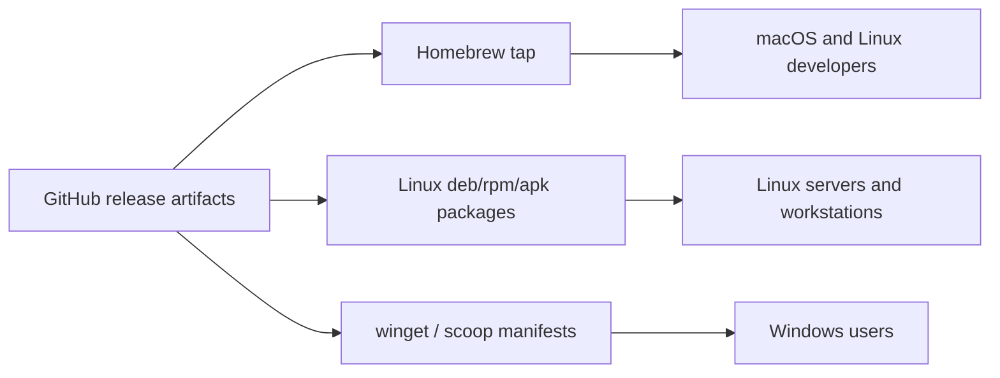

# Distribution Strategy

This document defines how `magi`, `magi-sync`, and related binaries should be distributed across macOS, Linux, and Windows.

The main goal is broad adoption with low friction:

- easy install for solo builders
- normal package-manager paths for developers
- automatable release flow for maintainers
- enterprise-friendly binaries and checksums

## Packaging Priorities

### 1. Homebrew

This should be the default path for macOS users and a strong option for Linux users running Homebrew.

Recommended package:

- `magi-sync`

Later:

- `magi`
- `magi-import`

Why:

- easiest path for developers
- common for self-hosters and homelab users
- good fit for Tailscale + local edge sync workflows

Recommended user experience:

```bash
brew install j33pguy/magi/magi-sync
```

## 2. Linux packages

Support:

- `.deb`
- `.rpm`
- `.apk`

These packages are mainly for `magi-sync` first, because it is the edge binary most likely to live on laptops, workstations, and utility VMs.

Recommended package-manager angles:

- Debian / Ubuntu: apt repo or direct `.deb`
- Fedora / RHEL: rpm repo or direct `.rpm`
- Alpine: `.apk`

## 3. Windows package managers

Recommended order:

1. `winget`
2. `scoop`
3. `chocolatey` if needed later

`winget` should be the priority because it is the most native and discoverable package manager for a wide Windows audience.

Recommended user experience:

```powershell
winget install j33pguy.magi-sync
```

## Release Foundation

The repo should produce:

- versioned archives
- checksums
- platform builds for macOS, Linux, Windows
- package metadata for Homebrew and Linux packages

That is what the `.goreleaser.yaml` file is intended to provide.

## Recommended Rollout Order



## Platform Strategy

### macOS

- Homebrew first
- signed archives later if needed

### Linux

- Homebrew plus native packages
- `.deb` as the first-class native format
- `.rpm` and `.apk` from the same release pipeline

### Windows

- zipped binaries in GitHub Releases
- `winget` as the native install path
- `scoop` as a secondary developer-friendly option

## Binary Strategy

### `magi`

Main memory server.

Best distributed as:

- GitHub release archives
- container images
- later Homebrew formula if desired

### `magi-sync`

Local edge sync binary.

Best distributed as:

- Homebrew
- Linux packages
- winget
- scoop

This should be the package-manager priority because it is the most likely binary to be installed on many user machines.

### `magi-import`

Useful support tool, but lower priority for package-manager discoverability.

Best distributed through GitHub release archives first.

## Tailscale Angle

`magi-sync` has a strong remote-access story because it can safely phone home to a MAGI server over Tailscale without exposing that server publicly.

That makes it especially important to package well for:

- laptops
- travel machines
- remote workstations
- utility containers

## Operational Notes

### Homebrew

Requires:

- a tap repository such as `j33pguy/homebrew-magi`
- release artifacts with stable checksums
- formula updates per release

### Linux packages

Requires:

- package metadata
- release artifacts
- optionally a hosted apt/rpm repository later

### winget

Requires:

- versioned Windows release artifacts
- manifest PRs to the `winget-pkgs` repository

### scoop

Requires:

- a bucket repository or manifest updates
- stable zip artifact URLs and checksums

## Recommendation

The packaging priority should be:

1. GitHub Releases for all binaries
2. Homebrew for `magi-sync`
3. Linux `.deb` / `.rpm` / `.apk` for `magi-sync`
4. winget for `magi-sync`
5. scoop for `magi-sync`

That path gives you the widest useful audience fastest without overbuilding every package system at once.
