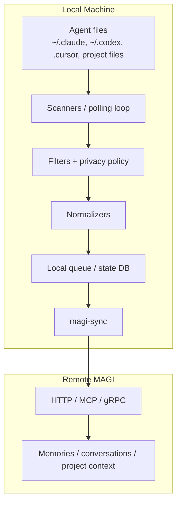
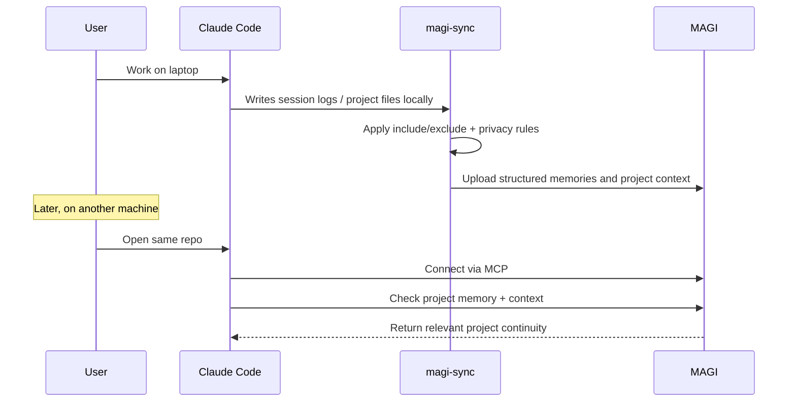
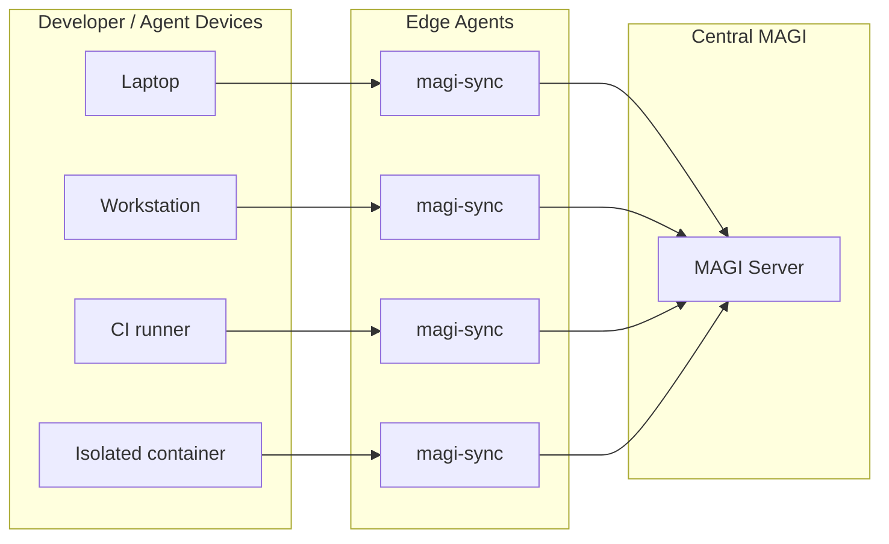
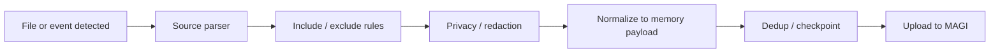
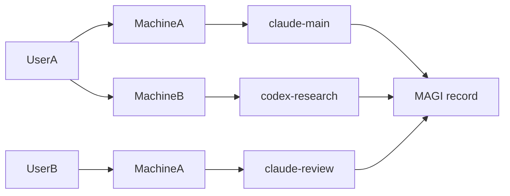
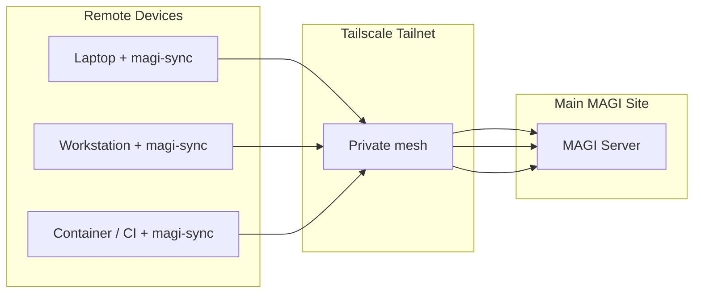

# magi-sync Design

`magi-sync` is the local edge binary that runs on isolated machines and feeds durable context into the main MAGI server.

It is separate from the MAGI server on purpose.

- `magi` is the shared memory server
- `magi-sync` is the local bridge between isolated agent environments and shared memory

This split keeps the central server simple while letting each machine enforce its own privacy, inclusion, and sync rules.

## Goals

- ingest useful local agent context into a shared MAGI instance
- support multiple isolated machines and multiple agent types
- allow strict privacy controls before anything leaves the machine
- make the first experience simple: install, configure, point at MAGI, and sync
- support both personal workflows and enterprise rollouts

## Non-Goals

- `magi-sync` is not the source of truth for memory
- `magi-sync` should not require direct remote filesystem access from the MAGI server
- `magi-sync` should not blindly upload every local file it sees
- `magi-sync` should not be coupled to a single agent vendor

## High-Level Architecture



## Core User Experience

### Personal / Cross-Machine



### Enterprise / Managed Fleet



## Agent Sources

`magi-sync` should support pluggable sources. The first pass can prioritize the most important ones.

### Phase 1 sources

- Claude Code
  - `~/.claude/projects/**/*.jsonl`
  - project `CLAUDE.md`
  - selected markdown files explicitly allowlisted in config
- Project-local markdown
  - `CLAUDE.md`
  - notes, runbooks, architecture docs

### Phase 2 sources

- Codex
- Cursor
- Windsurf
- Continue
- Roo / Cline
- terminal history
- editor history

## Sync Model

Longer-term, `magi-sync` should support three modes:

- `push`
  - send local discoveries to MAGI
- `pull`
  - retrieve selected project context or synced files from MAGI
- `bidirectional`
  - combine both where appropriate

Current implementation:

- Phase 1 accepts only `push`
- config validation rejects `pull` and `bidirectional`
- selective `pull` remains a later phase once rehydration semantics are tighter

Recommended default:

- `push` for early versions
- add selective `pull` for project context and approved synced files later

## Local Processing Pipeline

Each local artifact should flow through the same stages:

1. discover file or event
2. identify source type
3. apply include/exclude rules
4. apply privacy/redaction policy
5. normalize into a structured MAGI payload
6. deduplicate locally where possible
7. enqueue for delivery
8. upload with retry/backoff
9. checkpoint success in local state



## Normalized Payload Types

`magi-sync` should not send arbitrary raw files when it can send higher-value structured records.

Current Phase 1 payloads:

- `project_context`
- `conversation`
- `conversation_summary`

Planned later payloads:

- `decision`
- `lesson`
- `incident`
- `preference`
- `state`

Each payload should carry:

- `project`
- `source_machine`
- `source_agent`
- `source_path`
- `session_id` when available
- `tags`
- `visibility`

## Enterprise Identity And Visibility

For enterprise and multi-user deployments, `magi-sync` should stamp every uploaded record with enough identity metadata for the central MAGI server to filter, route, and eventually enforce access policy.

Recommended identity shape:

- `user`
- `machine`
- `identity = user.machine`
- `agent`
- `agent_name`
- `owner`
- `viewer`
- `viewer_group`
- `visibility`

This supports patterns like:

- `UserA.MachineA`
- `UserA.MachineB`
- `UserB.MachineA`

without requiring per-machine custom schemas.



### Current Phase 1 approach

Phase 1 keeps this lightweight but real:

- `magi-sync` emits identity and visibility tags
- MAGI stores the records normally
- MAGI now enforces owner/viewer/viewer_group-aware filtering on authenticated recall/search/list paths
- machine credentials are enrolled through the machine registry and write through the dedicated sync route

Example tags:

- `user:UserA`
- `machine:MachineA`
- `identity:UserA.MachineA`
- `owner:UserA`
- `viewer:UserB`
- `viewer_group:platform`
- `visibility:team`

### Future enforcement path

Later phases can add explicit server-side policy and UI controls built on top of the same model:

- owner-only memories
- team-visible memories
- per-project visibility
- role-based filtering for dashboards and APIs
- approval-gated file sync for sensitive paths

## Privacy Model

Privacy has to be local-first.

Nothing should leave the machine until it passes local policy.

### Policy features

- per-agent enable/disable
- per-path include/exclude
- glob-based rules
- file size limits
- machine-specific denylist
- redact secrets before upload
- allowlist mode for high-security environments
- dry-run mode for validation

### Recommended privacy modes

- `allowlist`
  - only configured paths and file classes are ingested
- `mixed`
  - known-safe paths ingested, sensitive patterns denied
- `denylist`
  - broad ingestion with explicit exclusions

For broad adoption, default to `allowlist`.

## Config Schema

Suggested config file: `~/.config/magi-sync/config.yaml`

```yaml
server:
  url: https://magi.example.com
  enroll_token_env: MAGI_ADMIN_TOKEN
  protocol: http

machine:
  id: laptop-macbook
  user: UserA
  groups:
    - platform

sync:
  mode: push
  watch: true
  interval: 30s
  retry_backoff: 5s
  max_batch_size: 50

privacy:
  mode: allowlist
  redact_secrets: true
  max_file_size_kb: 512

agents:
  - type: claude
    name: claude-main
    enabled: true
    owner: UserA
    viewers:
      - UserB
    viewer_groups:
      - platform
    paths:
      - ~/.claude
    include:
      - "**/projects/**/*.jsonl"
      - "**/CLAUDE.md"
      - "**/.claude/**/*.md"
    exclude:
      - "**/tmp/**"
      - "**/cache/**"
      - "**/*.bin"
    visibility: internal

  - type: codex
    enabled: false
    paths:
      - ~/.codex

projects:
  auto_detect_git: true
  fallback_to_directory: true
```

Recommended bootstrap flow:

1. set `server.enroll_token` or `server.enroll_token_env`
2. run `magi-sync enroll`
3. let `magi-sync` persist the returned machine token into `server.token`
4. let steady-state sync use the dedicated machine write path

## Local State

`magi-sync` needs local checkpoint state to avoid duplicate uploads and support restart safety.

Suggested uses:

- file checksums
- last processed offsets for JSONL logs
- last successful upload timestamp
- retry queue
- conflict markers

Current implementation starts with a local JSON state file. A SQLite state store is the next upgrade path once the retry and pull stories get more complex.

## Transport

Recommended order:

1. HTTP API first
2. MCP where appropriate for local agent-facing flows
3. gRPC later for higher-throughput edge sync

Why HTTP first:

- easiest for a standalone binary
- easiest to secure and observe
- easiest for enterprise environments and reverse proxies

## Remote Access

`magi-sync` needs a safe way to reach the main MAGI server when the machine is not on the same local network.

Recommended order:

1. **Tailscale**
2. reverse proxy with strong auth
3. direct public exposure only when absolutely necessary

### Why Tailscale first

- private mesh networking without exposing MAGI broadly to the public internet
- simple per-device identity
- works well for laptops, workstations, servers, and containers
- good fit for personal setups and serious internal deployments
- keeps the "phone home" story simple: connect to your tailnet, reach the MAGI server by private name or IP

### Tailscale deployment model



### Config implication

`magi-sync` should accept a normal server URL, but the recommended remote URL should be a Tailscale hostname or private tailnet IP:

```yaml
server:
  url: http://magi.tailnet-name.ts.net:8302
  token_env: MAGI_API_TOKEN
  protocol: http
```

If TLS termination or a reverse proxy is present on the MAGI side, that can sit behind Tailscale too.

## Delivery Semantics

Aim for:

- at-least-once delivery from `magi-sync` to MAGI
- idempotent ingest behavior through content hashing and source metadata

That is a better trade-off than trying to guarantee exactly-once across restarts and unstable networks in v1.

## Pull / Rehydration Model

Early rehydration should focus on project memory, not full remote file sync.

Recommended first pull targets:

- project context
- recent decisions
- recent incidents and lessons
- recent conversation summaries

This lines up with the current MAGI concepts of project detection, `memory://context`, and `sync_now`.

## Product Story

The intended experience should be:

- install MAGI once
- install `magi-sync` on each isolated machine
- point local agents at MAGI via MCP
- let `magi-sync` capture durable local context in the background
- open the same repo elsewhere and resume with continuity

## Phased Rollout

### Phase 1 — Claude-first push sync

- standalone `magi-sync` binary
- config file
- Claude session log ingestion
- `CLAUDE.md` and project markdown ingestion
- include/exclude + privacy allowlist
- HTTP push to MAGI

### Phase 1 delivery slices

#### Slice 1 — binary skeleton

- `cmd/magi-sync`
- config file loader
- structured logging
- local state directory

#### Slice 2 — config + policy

- parse YAML config
- expand `~` in paths
- validate include/exclude rules
- implement privacy allowlist mode

#### Slice 3 — Claude source adapter

- scan configured Claude paths
- find session JSONL files
- find `CLAUDE.md` and selected markdown context files
- normalize records into MAGI payloads

#### Slice 4 — local state and dedup

- SQLite state DB for processed file hashes and offsets
- resume after restart
- avoid re-uploading the same local artifacts repeatedly

#### Slice 5 — uploader

- HTTP client to MAGI
- token auth
- retry / backoff
- batch upload path

#### Slice 6 — watch loop

- periodic polling first
- file watching later if needed
- dry-run mode to inspect what would be uploaded

#### Slice 7 — remote-use hardening

- document Tailscale setup
- support private tailnet hostname in config
- add connectivity check command

### Phase 1 success criteria

- install `magi-sync` on one laptop
- point it at one MAGI server
- ingest selected Claude session history and `CLAUDE.md`
- preserve privacy with allowlist rules
- reconnect from another network over Tailscale
- verify project context is available on another machine through MAGI

### Phase 2 — Project rehydration

- pull project context from MAGI
- prioritize `project_context` and recent decisions
- make fresh clone experience smoother

### Phase 3 — Multi-agent adapters

- Codex source adapter
- Cursor / Windsurf / Continue adapters
- common source interface

### Phase 4 — Enterprise controls

- managed config rollout
- policy validation
- audit logs
- machine identity registry
- selective remote disablement

## Open Decisions

These are the questions to keep checking as the feature grows:

- Should synced files ever be stored as raw files, or only as normalized MAGI memories?
- How much pull-based file sync should exist versus memory-only rehydration?
- Which transport should be canonical for edge sync long-term: HTTP or gRPC?
- How much local redaction should be heuristic versus strict policy-based?
- Should `magi-sync` be one binary with adapters, or separate per-agent plugins?

## Recommendation

Build `magi-sync` as one standalone binary with:

- a pluggable source adapter model
- HTTP transport first
- local-first privacy controls
- push sync first
- Claude-first implementation

That gets the cross-machine continuity story real as fast as possible while leaving room to support more agents and stricter environments later.
