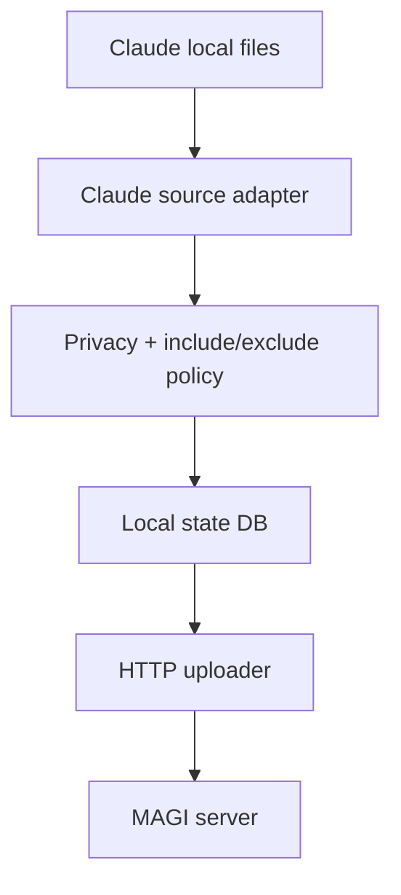

# magi-sync Phase 1 Plan

Phase 1 is the smallest version of `magi-sync` that proves the product loop is real.

Current implementation status:

- standalone `magi-sync` CLI exists
- `check`, `dry-run`, `once`, `run`, and `enroll` are implemented
- Claude-first ingestion is implemented
- sync is push-only in Phase 1
- local checkpointing currently uses a JSON state file

The goal is simple:

- install a local binary on one isolated machine
- point it at one MAGI server
- ingest selected Claude local context safely
- make that context available from another machine later

## Scope

Phase 1 currently supports:

- one standalone `magi-sync` binary
- YAML config file
- Claude-first source adapter
- allowlist-based privacy rules
- periodic polling
- HTTP upload to MAGI
- Tailscale-friendly remote access
- machine enrollment against the MAGI registry

Phase 1 does not require:

- bidirectional file sync
- multi-agent plugin architecture
- complex conflict resolution
- direct filesystem mirroring
- gRPC edge transport

## Phase 1 Architecture



## Source Inputs

Start with a strict, high-value subset:

- `~/.claude/projects/**/*.jsonl`
- project `CLAUDE.md`
- optional project markdown files explicitly allowlisted by config

## Output Types

Phase 1 currently normalizes local inputs into:

- `conversation`
- `conversation_summary`
- `project_context`

## CLI Shape

Suggested commands:

```bash
magi-sync run
magi-sync check
magi-sync enroll
magi-sync dry-run
magi-sync once
```

### `run`

- starts polling loop
- reads config
- uploads newly discovered artifacts

### `check`

- validates config
- checks connectivity to MAGI
- checks that configured paths exist

### `dry-run`

- shows what would be ingested
- shows what would be skipped by privacy policy

### `once`

- performs one sync cycle and exits

## Config Draft

```yaml
server:
  url: http://magi.tailnet-name.ts.net:8302
  enroll_token_env: MAGI_ADMIN_TOKEN

machine:
  id: laptop-macbook
  user: UserA
  groups:
    - platform

sync:
  interval: 30s
  mode: push

privacy:
  mode: allowlist
  redact_secrets: true

agents:
  - type: claude
    name: claude-main
    enabled: true
    owner: UserA
    viewers:
      - UserB
    viewer_groups:
      - platform
    paths:
      - ~/.claude
    include:
      - "**/projects/**/*.jsonl"
      - "**/CLAUDE.md"
    exclude:
      - "**/tmp/**"
      - "**/cache/**"
```

## Delivery Order

### Step 1

Create `cmd/magi-sync` and a minimal config loader.

### Step 2

Add a Claude adapter that:

- scans configured paths
- identifies candidate JSONL and markdown files
- extracts project identity where possible

### Step 3

Add privacy filtering:

- include/exclude matching
- file size cap
- secret redaction hook

### Step 4

Add local checkpoint state:

- processed file hashes
- offsets for JSONL logs
- upload checkpoints

### Step 5

Add HTTP uploader to MAGI:

- machine or admin auth token
- dedicated sync write path
- retry/backoff

### Step 6

Add `check`, `dry-run`, and `once` commands.

## Tailscale Requirement

Phase 1 should treat Tailscale as the default remote access pattern.

That means:

- docs should show Tailscale hostnames in examples
- connectivity checks should work against tailnet addresses
- no assumption that MAGI is publicly exposed

## Success Test

The end-to-end proof should be:

1. run MAGI on one home/server machine
2. expose it over Tailscale
3. install `magi-sync` on laptop A
4. ingest selected Claude context
5. open the same repo on laptop B
6. connect Claude Code to the same MAGI instance
7. confirm that project memory is available without reconstructing everything manually
