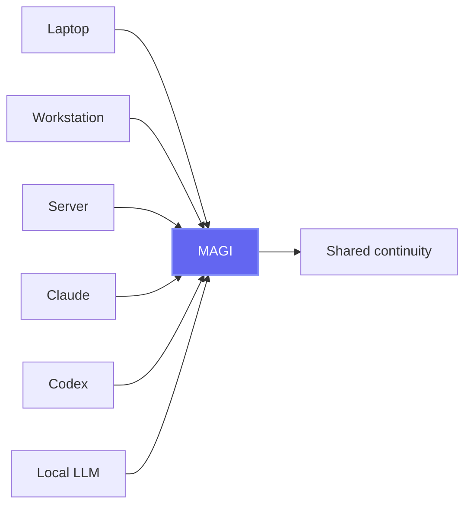
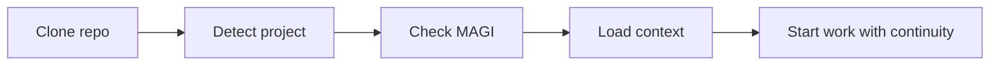
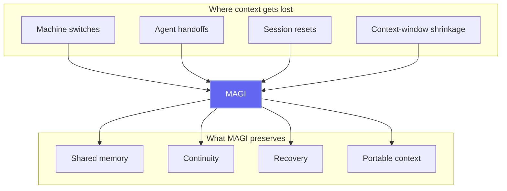

# Messaging Drafts

This file contains ready-to-adapt copy for the website, wiki, README, and docs. The language is intentionally less technical than the architecture docs while still staying accurate to the product.

## Core Positioning

**Short tagline**

Shared memory and continuity for isolated AI agents.

**Longer product line**

MAGI gives Claude, Codex, Cursor, GPT, Grok, local models, internal tools, and orchestrators one durable memory layer across machines, sessions, and workflows.

**Boundary statement**

MAGI is the memory layer, not the orchestrator.

## Homepage Draft

### Hero

**Headline**

Shared memory and continuity for isolated AI agents

**Subhead**

Move between machines, recover after resets, and transfer context across Claude, Codex, Cursor, GPT, Grok, local models, and internal tools. Start with one self-hosted container. Scale to enterprise-ready deployments when you need to.

### Problem Section

Your agents do useful work, but their context is fragile.

- Switch computers and the memory stays behind.
- Lose a session to overload or context-window shrinkage and the agent forgets where it was.
- Hand work from one agent to another and too much of the why disappears.

MAGI gives those agents one durable place to store and recover context.

### Three Core Use Cases

#### 1. Move between machines without losing context

Your memory should not live and die on one laptop. MAGI keeps context portable across your computers, servers, and containers.

#### 2. Let one agent continue where another stopped

Research in Grok. Design in Claude. Build in Codex. MAGI carries the context forward so every agent starts from what is already known.

#### 3. Recover after resets and degraded sessions

When an agent loses context after a provider outage, model swap, or shrinking context window, MAGI gives it a durable memory to rehydrate from instead of forcing you to rebuild everything manually.

#### 4. Clone a repo and recover project context quickly

When a project already has memory in MAGI, a fresh clone on a new machine should not feel like a fresh start. The right experience is: detect the project, check memory, pull context, and continue.

### Product Definition

MAGI is a shared memory and continuity layer for isolated agents, tools, and services.

- It is not tied to one vendor.
- It is not limited to one machine.
- It is not only for coding agents.
- It is not only for local toy setups.

It starts simple and grows with you:

- one container + SQLite
- MAGI + PostgreSQL
- role-separated worker containers for higher load

### Easy Adoption Angle

The easiest adoption story is not “deploy a whole multi-agent platform.”

It is:

1. Run MAGI once.
2. Point Claude Code at the MAGI MCP server.
3. Start storing and recalling memory through one shared system.
4. Reuse that same memory on another machine or in another agent later.

That makes MAGI immediately useful before a user ever builds a larger multi-agent workflow.

## Wiki Home Draft

MAGI is a self-hosted memory server for AI systems. It provides a shared, persistent context layer across isolated agents, tools, services, and devices through MCP, REST, and gRPC.

MAGI was built to solve a simple problem first: agent memory was getting trapped on one machine. Switching computers meant losing continuity or digging through local files to reconstruct context. From there, the problem grew into something bigger: agents, sessions, and devices all lose context in different ways.

MAGI solves that by giving every agent a durable place to store and recall findings, decisions, incidents, lessons, conversations, and project context.

### Suggested opening bullets

- Shared memory for isolated AI agents
- Cross-machine continuity for local and self-hosted workflows
- Durable recovery after resets, overloads, and lost context
- Self-hosted by default, enterprise-capable by design
- Starts with one node, scales to containerized worker roles

## README Draft Snippets

### Suggested opening line

MAGI is the shared memory and continuity layer for isolated AI agents.

### Suggested one-paragraph explainer

It lets Claude, Codex, Cursor, GPT, Grok, local models, and internal tools share durable context across machines, sessions, and workflows. Use it to move between computers without losing memory, recover after resets or shrinking context windows, and let one agent pick up where another stopped.

### Suggested "Why now?" section

Agent workflows are becoming more fragmented, not less. People switch between multiple models, multiple devices, and multiple tools. Sessions reset. Providers overload. Context windows shrink. MAGI gives those workflows a durable memory layer so useful context survives the things that normally wipe it out.

## FAQ Additions

### Why would I need MAGI if my agent already has memory?

Most agent memory is local to one tool, one session, or one machine. MAGI is useful when you want that memory to survive machine switches, session resets, provider instability, or handoffs between different agents and tools.

### Is MAGI only for multi-agent systems?

No. A strong single-agent, multi-machine workflow is one of the best reasons to use MAGI. If you use the same agent across multiple computers, MAGI keeps context from getting trapped on one device.

### What happens when an agent loses context?

Instead of rebuilding context manually from local files or old prompts, you can point the agent at MAGI and let it recall what matters. MAGI is designed to support rehydration after resets, overloads, and context-window loss.

### What happens when I clone a repo that already has memory in MAGI?

The desired MAGI workflow is that the project is detected automatically, the agent checks MAGI for relevant project context, and work resumes with continuity instead of starting from zero. This is one of the most important user experiences to optimize.

### Is MAGI only for self-hosters and hobbyists?

No. MAGI starts with a simple self-hosted deployment, but it is designed to plug into serious environments too. It supports multiple protocols, multiple storage backends, and a scale path from one container to role-separated services.

## Documentation Framing

Use this structure consistently across docs:

1. **Continuity**
   How MAGI preserves context across machines and sessions.
2. **Collaboration**
   How MAGI enables agent-to-agent handoffs.
3. **Deployment**
   How it runs from local setups to LXC/Docker to scaled services.
4. **Governance**
   How memory types, visibility, and git-backed history keep memory inspectable.
5. **Performance**
   How async writes, caches, and worker roles keep the system fast.
