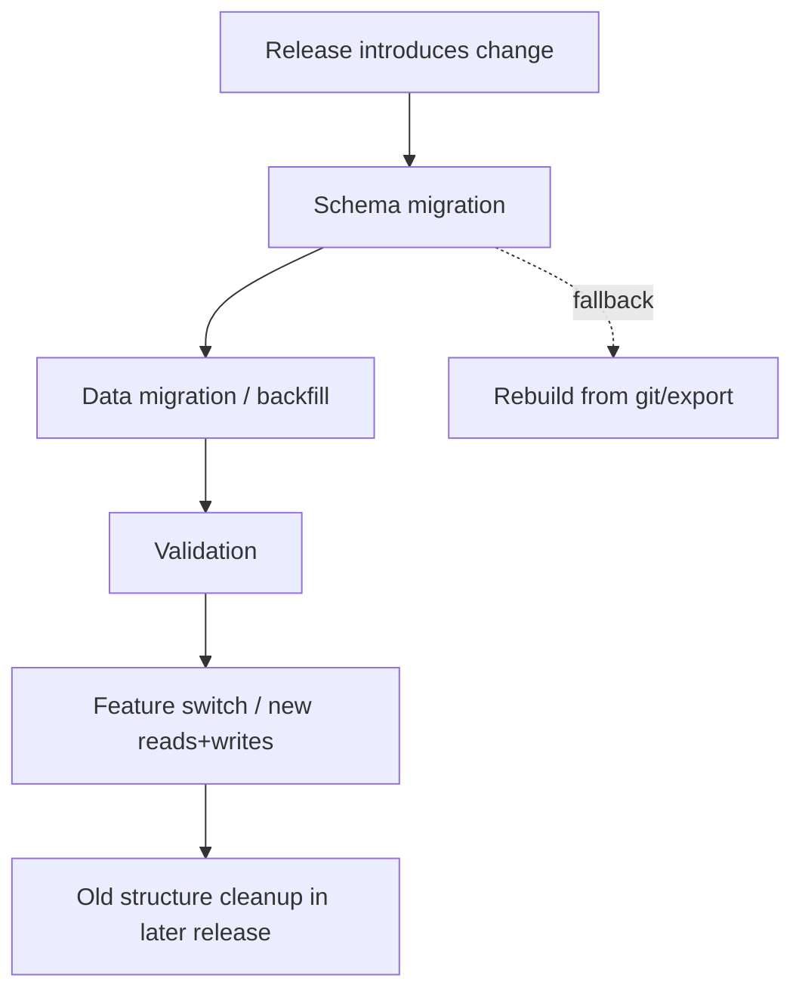
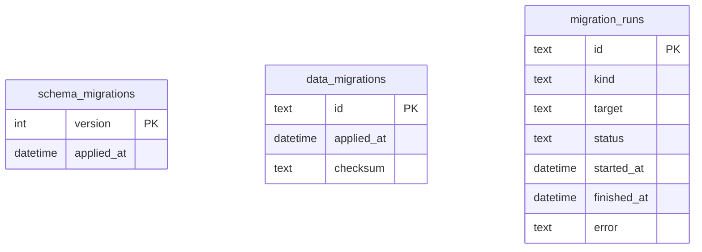
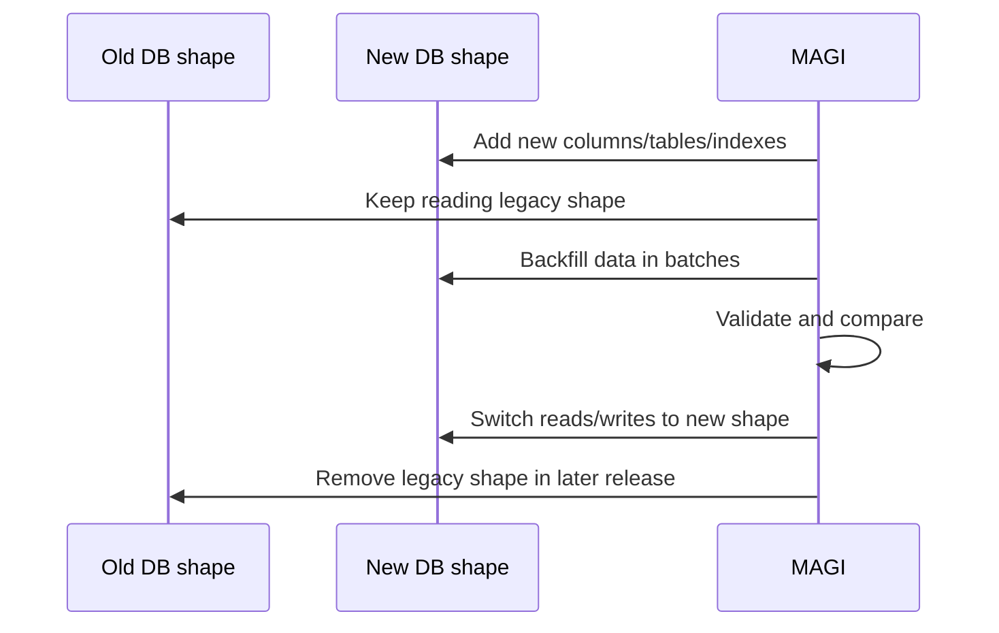

# Database Migration Strategy

MAGI needs a migration story that stays safe even as the memory model keeps evolving.

Simple additive schema migrations are easy. The dangerous cases are:

- renaming or removing columns
- changing how memory types are represented
- splitting one concept into multiple tables
- introducing new access-control semantics
- changing how embeddings, tags, or project context are stored

This document defines the strategy MAGI should follow so old memories stay recoverable and upgrades do not become a gamble.

## Goals

- keep startup migrations safe and boring
- preserve old memories across schema changes
- support all backends with the same logical migration plan
- make recovery and rollback realistic
- avoid one-off ad hoc upgrade code

## Migration Types

MAGI should treat database change as three separate layers:

1. **Schema migrations**
Add or change tables, columns, indexes, constraints, and triggers.

2. **Data migrations**
Backfill, normalize, rewrite, or re-tag existing memories to match a new model.

3. **Rebuild migrations**
Recreate derived state from a durable source of truth such as git-backed memory history or exported memory files.



## Core Rule

For major changes, MAGI should use **expand and contract**, not destructive in-place rewrites.

That means:

- first add the new structure
- backfill old data into it
- read both old and new shapes during transition if needed
- switch writes to the new shape
- remove the old shape only in a later release

This keeps upgrades survivable.

## Recommended Metadata Tables

Today MAGI tracks only `schema_migrations`.

For larger upgrades, MAGI should also track:

- `data_migrations`
  - logical backfills and record rewrites
- `migration_runs`
  - optional audit log for start/end/error/duration

Suggested shape:



## What Belongs In Schema Migrations

Safe startup schema migrations should be limited to things like:

- create table if not exists
- add nullable column or column with safe default
- create index
- create trigger
- create new shadow table

Avoid doing these in startup schema migrations unless absolutely necessary:

- large row-by-row rewrites
- dropping old columns/tables immediately
- recomputing embeddings for the full corpus
- cross-table semantic rewrites of existing memories

Those belong in data migrations or explicit upgrade flows.

## What Belongs In Data Migrations

Data migrations should be first-class and idempotent.

Examples:

- converting old `type=note` records into a richer model
- stamping owner tags onto legacy private conversations
- backfilling new normalized identity metadata
- re-tagging project context memories after a naming change
- splitting a legacy field into multiple derived fields

Recommended properties:

- idempotent
- resumable
- chunked / batched
- observable in logs
- safe to rerun

## Major-Change Pattern

For breaking or shape-changing upgrades, use this pattern:

1. Add new schema elements.
2. Keep old reads and writes working.
3. Backfill existing records in batches.
4. Validate counts, spot-check records, and measure failures.
5. Switch reads to prefer the new structure.
6. Switch writes fully to the new structure.
7. Remove legacy structures in a later release.



## Backend Strategy

MAGI supports multiple backends, so the migration policy should be:

- **same logical migration version across backends**
- **backend-specific DDL**
- **backend-agnostic data migration logic in Go where possible**

Why:

- SQL DDL differs across SQLite, Turso, PostgreSQL, MySQL, and SQL Server
- semantic rewrites of memories should not be implemented five different ways

So:

- schema migrations remain per backend
- data migrations should prefer Go code that uses the shared store interfaces when feasible

## Safe Upgrade Path

Before a major MAGI upgrade, operators should have a clean path:

1. snapshot or back up the database
2. preserve git-backed memory history if enabled
3. run schema migrations
4. run any required data migrations / backfills
5. validate counts and health
6. only then enable the new feature path

## Recovery Paths

MAGI already has strong building blocks here:

- git-backed memory versioning
- import tooling
- rebuild-from-git behavior for empty databases

That means recovery can be layered:

- **fast rollback**: restore DB backup
- **logical rebuild**: rebuild derived DB state from git-backed memory history
- **migration export/import**: export old memories and re-import into a clean DB when needed

## Recommended Product Direction

The cleanest long-term approach is:

- keep startup `schema_migrations`
- add `data_migrations`
- add an explicit migration runner for major backfills
- document when a release is:
  - startup-safe only
  - requires backfill
  - requires operator action

Suggested future commands:

```bash
magi migrate status
magi migrate run
magi migrate dry-run
magi migrate export
```

These do not all exist today, but they are the right shape for a serious upgrade story.

## Release Policy Suggestion

Classify DB-affecting releases like this:

- **Patch-safe**
  - additive schema only
  - no operator action expected
- **Upgrade-safe with backfill**
  - startup works
  - background or explicit data migration required
- **Breaking / operator-managed**
  - requires maintenance window, export/import, or explicit migration steps

That gives operators a realistic risk signal before they upgrade.

## Immediate Next Steps

The best near-term migration work for MAGI is:

1. add a `data_migrations` table
2. define a Go-level migration runner interface for backfills
3. add upgrade classification to release notes
4. document backup and recovery expectations before major upgrades
5. use expand-and-contract for the first real shape-changing migration

## Bottom Line

MAGI should not rely only on startup SQL migrations forever.

For a fast-moving memory product with multiple backends, the clean path is:

- schema migrations for shape
- data migrations for meaning
- rebuild/export paths for recovery
- expand-and-contract for major changes

That is what will keep old memories safe while the product matures.
