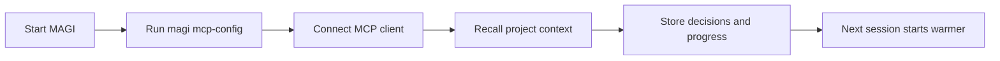
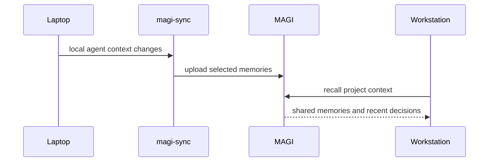

# Onboarding

MAGI is model- and agent-agnostic, self-hosted, and has zero cloud dependency by default.

The fastest way to understand MAGI is to get to the first useful recall quickly.

## Fast First Run

For most first-time users, these defaults give the smoothest path:

```bash
export MEMORY_BACKEND=sqlite
export MAGI_ASYNC_WRITES=true
export MAGI_CACHE_ENABLED=true

./magi --http-only
```

Why these defaults:

- SQLite keeps the first run simple
- async writes keep remember flows snappy
- cache keeps repeat recall and embeddings hot

## Fastest MCP Path

If your first goal is to make an MCP-compatible agent recall project context better:

1. Start MAGI.
2. Run `magi mcp-config`.
3. Paste the output into your MCP client config.
4. Ask the agent to `recall` before it starts work.
5. Ask the agent to `remember` decisions, incidents, and lessons as it goes.



## What Makes It Feel Fast

Once cache is enabled, MAGI keeps the hottest parts of recall close:

- repeat recall queries stay in the query cache for a short TTL
- recently recalled and frequently fetched memories stay in the memory cache
- repeated embeddings avoid unnecessary ONNX work

That means the first recall does the heavier work, and the next similar recall is usually faster.

## Cross-Machine First Win

If you use isolated agents on multiple computers:

1. run one MAGI server on a stable host
2. connect each machine's agent to that MAGI instance
3. optionally install `magi-sync` on each machine
4. enroll each `magi-sync` instance once
5. let it ingest selected local context into shared memory



## Recommended Early Defaults

- `SQLite` for first run and solo setups
- `PostgreSQL` when the server becomes shared or long-lived
- `MAGI_CACHE_ENABLED=true` for real usage
- `MAGI_ASYNC_WRITES=true` unless you are debugging write ordering
- `magi-sync` when you want continuity across isolated machines

## After The First Win

Once the first agent loop feels good, the next step is usually one of these:

- connect a second machine to the same MAGI server
- install `magi-sync`
- move from SQLite to PostgreSQL
- turn on auth and machine enrollment
- start storing structured memories like lessons, incidents, and project context
