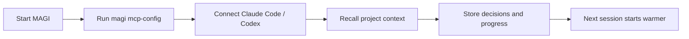
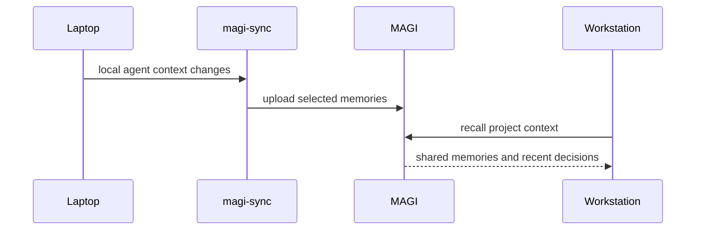

# Onboarding

MAGI is still a work in progress, but the easiest way to understand it is to get to the first useful recall as quickly as possible.

## Fast First Run

For most people, these are the best first-run defaults:

```bash
export MEMORY_BACKEND=sqlite
export MAGI_ASYNC_WRITES=true
export MAGI_CACHE_ENABLED=true

./magi --http-only
```

Those settings give you:

- simple local storage
- fast writes
- a hot cache for repeated recall
- a good baseline before you move to PostgreSQL or distributed roles

## Fastest Agent Path

If your first goal is "make Claude Code or Codex remember this project better," use this flow:

1. Start MAGI.
2. Run `magi mcp-config`.
3. Paste the output into your MCP client config.
4. Ask the agent to check MAGI for project context before starting work.
5. Ask the agent to store decisions, incidents, and lessons as it goes.



## What Makes It Feel Fast

Once cache is enabled, MAGI keeps the hottest parts of recall close:

- repeated recall queries stay in the query cache for a short TTL
- recently recalled and frequently fetched memories stay in the memory cache
- repeated identical embeddings avoid unnecessary ONNX work

That means the first recall does the heavier work, and the next similar recall usually feels much better.

## Cross-Machine First Win

If you use isolated agents on multiple computers:

1. run the main MAGI server somewhere stable
2. connect each machine's agent to the same MAGI instance
3. optionally install `magi-sync` on each machine
4. enroll each `magi-sync` instance once
5. let it ingest selected local agent context into shared memory



## Recommended Early Defaults

For a broad audience, this is the easiest ladder:

- `SQLite` for first run and solo setups
- `PostgreSQL` when the server becomes shared or long-lived
- `MAGI_CACHE_ENABLED=true` for real use
- `MAGI_ASYNC_WRITES=true` unless you are debugging write ordering
- `magi-sync` when you want continuity across isolated machines

## After The First Win

Once the first agent loop feels good, the next step is usually one of these:

- connect a second machine to the same MAGI server
- install `magi-sync`
- move from SQLite to PostgreSQL
- turn on auth and machine enrollment
- start storing more structured memories like lessons, incidents, and project context
