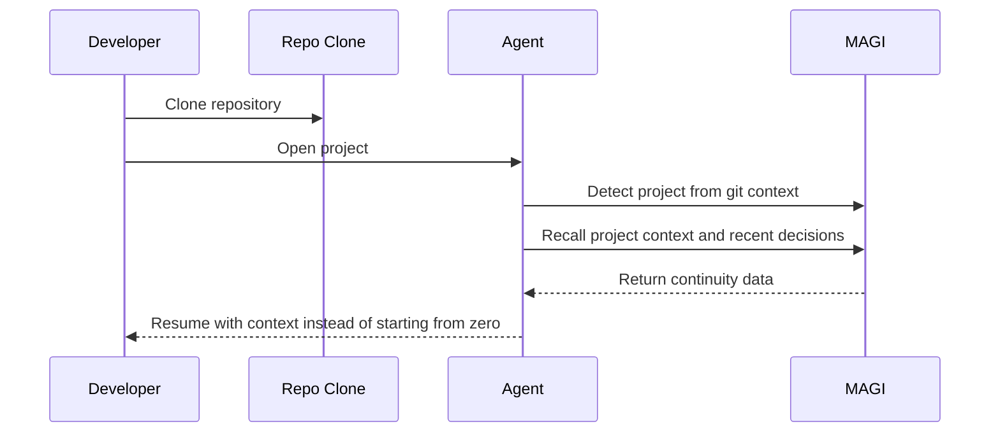
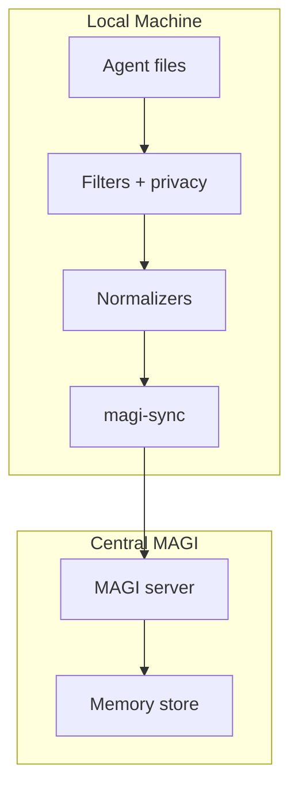

# Strategy Rollup

This document consolidates the current MAGI product, architecture, deployment, sync, and enterprise recommendations into one place.

## Core Positioning

MAGI is:

- shared memory for isolated AI agents
- continuity infrastructure for fragile agent sessions
- portable context across machines, agents, and environments
- self-hosted by default, enterprise-capable by design

Short version:

> Shared memory and continuity for isolated AI agents.

Longer product line:

> Move between machines, recover from resets, and transfer context across Claude, Codex, Cursor, GPT, Grok, local models, and internal tools.

## The Problems MAGI Solves

### Cross-machine continuity

Agent context often stays trapped on one laptop, workstation, or server.

MAGI should let the same user move between:

- `UserA.MachineA`
- `UserA.MachineB`
- `UserA.MachineC`

without rebuilding context manually.

### Cross-agent handoffs

Research, architecture, coding, and ops agents do not naturally share context.

MAGI should make handoffs durable:

- research agent stores findings
- architecture agent stores decisions
- coding agent recalls both and continues

### Session resilience

Agent sessions are fragile.

Common failure modes:

- shrinking context windows
- provider overload
- interrupted sessions
- model swaps
- degraded memory after restarts

MAGI should let an agent rehydrate from memory instead of searching through local files and starting over.

### Project rehydration

A fresh clone of a repo should not feel like a cold start if MAGI already knows the project.

Desired flow:

## Primary Audiences

### Solo builders

People using one or two agents across multiple computers.

Best entry message:

> Switch computers without losing your agent context.

### Multi-agent users

People splitting work across Claude, Codex, Cursor, GPT, Grok, or local models.

Best entry message:

> Let one agent pick up where another left off.

### Self-hosters and homelabs

People who want local control, low-friction setup, and portability.

Best entry message:

> Start with one container and SQLite. Scale later only if you need to.

### Teams and enterprise

Organizations that need auditability, access control, and infrastructure fit.

Best entry message:

> Add a self-hosted memory and continuity layer across users, agents, services, and machines.

## Product Principles

### Fast on one box first

The fast path should remain:

- one process
- local caches
- local embeddings
- async writes
- coordinator on

### Scale by role, not by cloning everything

When load grows, MAGI should split by bottleneck:

- `magi-api`
- `magi-writer`
- `magi-reader`
- `magi-index`
- `magi-embedder`

### Flexible defaults, opinionated guidance

Support many backends, but recommend one path per stage:

- `SQLite` for quickstart
- `PostgreSQL` for production and distributed scale
- `Turso` for sync-oriented and multi-device setups
- `MySQL` and `SQL Server` for compatibility and enterprise fit

### Privacy and ownership first

Machines should not blindly upload everything.

The sync side must support:

- include/exclude paths
- allowlist mode
- secret redaction
- owner and viewer metadata
- machine and agent identity

## Recommended Deployment Ladder

### Tier 1: Quickstart

- one MAGI container
- SQLite
- local ONNX embeddings
- MCP + REST

### Tier 2: Standard

- MAGI + PostgreSQL
- reverse proxy
- auth for UI/API
- persistent volumes

### Tier 3: Stress / Scale-Out

- role-separated containers
- PostgreSQL
- async writes on
- coordinator on
- embedders split out
- metrics and health probes enabled

## `magi-sync` Direction

`magi-sync` is the edge binary that runs on isolated machines and feeds MAGI.

Responsibilities:

- discover local agent artifacts
- apply privacy policy
- normalize data into memories
- upload to MAGI
- eventually pull approved project context back down

High-level flow:

Phase 1 priorities:

- Claude-first ingestion
- push sync
- local privacy enforcement
- machine/user/agent tagging
- Tailscale-friendly deployment

## Identity And Access Direction

MAGI should model:

- `user`
- `machine`
- `agent`
- `owner`
- `viewer`
- `viewer_group`

This should support structures like:

- `UserA.MachineA.claude-main`
- `UserA.MachineB.codex-review`
- `UserB.MachineA.claude-ops`

Current direction:

- `magi-sync` emits identity metadata as tags
- HTTP recall/search/list can enforce tag-based access rules
- full authenticated identity should replace caller-supplied headers over time

## Auth Direction

The recommended split is:

- humans: OIDC / Authentik
- machines: per-machine tokens first, then mTLS or short-lived machine credentials

Public UI and machine sync should not share the exact same auth path.

Preferred endpoint split:

- UI behind Authentik
- dedicated sync/API route for `magi-sync`
- health/readiness routes accessible for ops or scoped infra use

## Documentation Priorities

These messages should be reflected consistently across:

- README
- website hero and problem section
- wiki home
- multi-agent docs
- deployment docs
- auth docs

The strongest recurring messages are:

- switch machines without losing context
- recover after resets and shrinking windows
- let one agent continue another's work
- start small, scale cleanly

## Near-Term Implementation Priorities

### Already underway

- `magi-sync` Phase 1
- session summaries and per-turn conversation extraction
- owner/viewer/group metadata tags
- initial access-aware HTTP recall/search/list filtering

### Next

1. Dedicated auth architecture and machine enrollment
2. Project rehydration flow and `memory://project-context`
3. Dedicated sync endpoint for `magi-sync`
4. Claude/Codex-specific adapters and project bootstrap instructions
5. MCP and resource-side access enforcement parity

