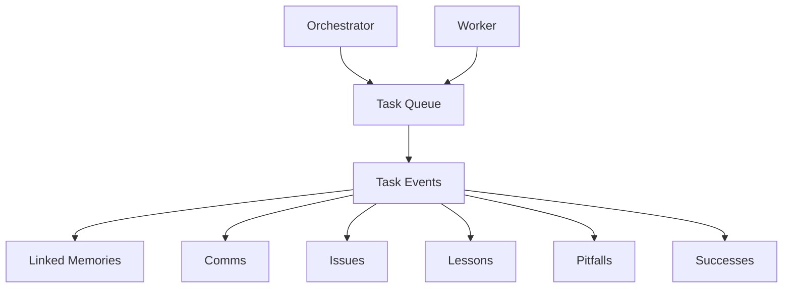
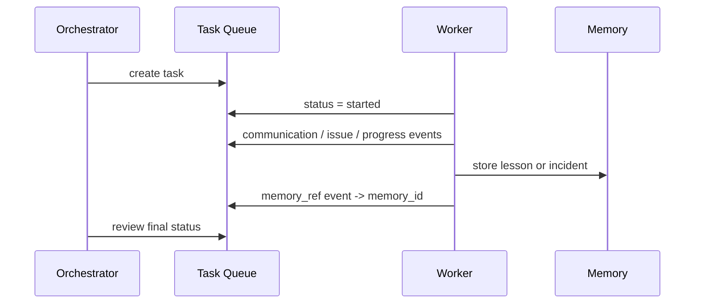

# Task Queue

MAGI now has a task queue that is separate from the main memory stack.

That separation is intentional:

- tasks track shared work and current progress
- memories capture durable context, lessons, incidents, decisions, and history
- task updates should not pollute recall results for long-term memory

## Why Separate Tasks From Memory

Memories are durable context.

Tasks are active coordination.

When an orchestrator assigns work to a worker, the system needs a shared place to answer questions like:

- what is queued right now
- what already started
- what is blocked
- what failed
- what did the worker report back
- which lessons or incidents came out of this task

That is better modeled as a queue plus an event log than as generic memories.

## Task Model

Each task stores:

- `project`
- `queue`
- `title`
- `summary`
- `description`
- `status`
- `priority`
- `created_by`
- `orchestrator`
- `worker`
- `parent_task_id`
- `metadata`

Current statuses:

- `queued`
- `started`
- `done`
- `failed`
- `blocked`
- `canceled`

Current priorities:

- `low`
- `normal`
- `high`
- `urgent`

## Task Events

Each task has an append-only event log.

Current event types:

- `status`
- `communication`
- `issue`
- `lesson`
- `pitfall`
- `success`
- `memory_ref`
- `note`

Each event can include:

- actor role/name/user/machine/agent
- summary
- detailed content
- status transition
- linked `memory_id`
- source
- metadata

That lets a task collect the actual working conversation between orchestrator and worker while still linking out to durable memories when something should live beyond the task itself.

## How Tasks And Memories Work Together

Use the task queue for:

- assignment
- in-flight status
- worker updates
- blockers
- task-specific comms

Use memories for:

- decisions worth keeping
- lessons worth reusing
- incidents worth recalling later
- project context
- conversation summaries with lasting value

When a task uncovers something durable, store that as memory and then attach it back to the task with a `memory_ref` event.

## Interfaces

HTTP endpoints:

- `POST /tasks`
- `GET /tasks`
- `GET /tasks/{id}`
- `PATCH /tasks/{id}`
- `POST /tasks/{id}/events`
- `GET /tasks/{id}/events`

MCP tools:

- `create_task`
- `list_tasks`
- `get_task`
- `update_task`
- `add_task_event`
- `list_task_events`

## Current Guidance

- use the task queue for active coordination
- use the memory system for durable recall
- link the two with `memory_ref` task events
- treat `TrackTask` in `internal/tracking` as legacy compatibility, not the preferred path
